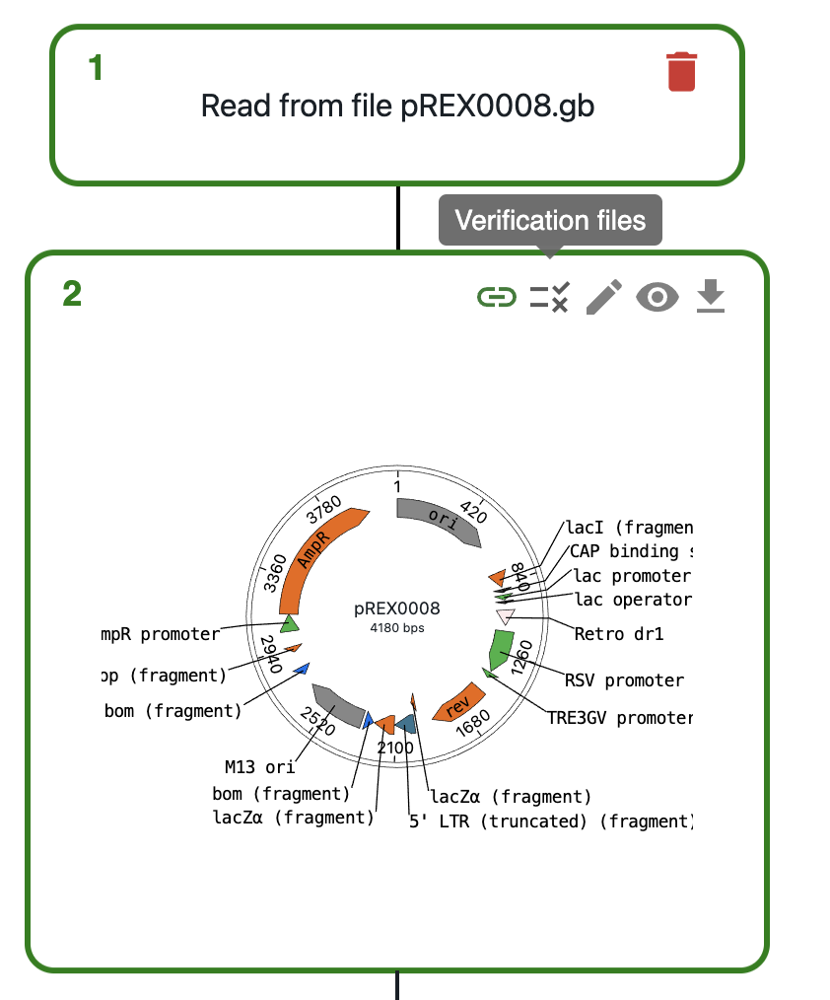
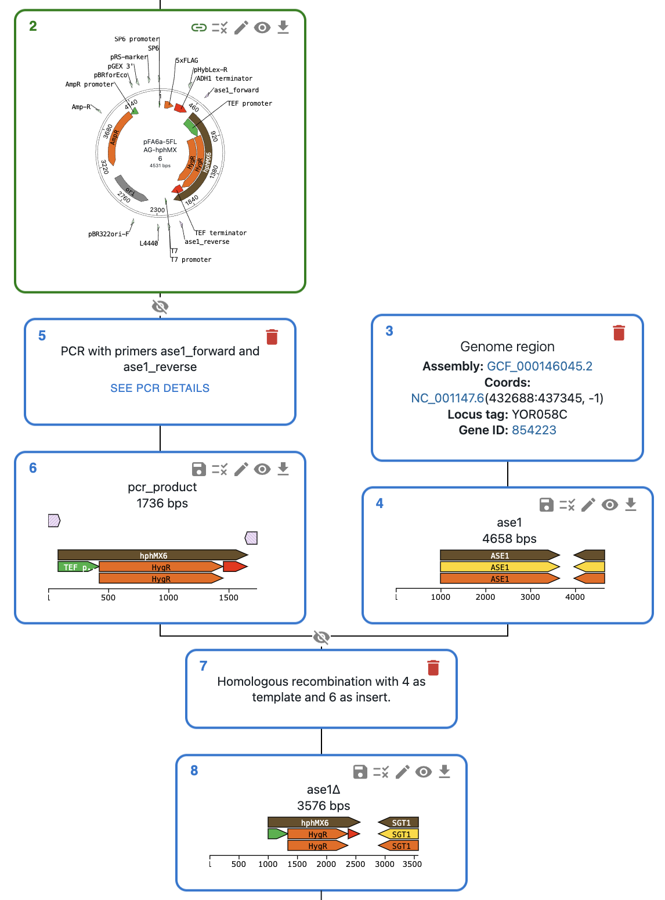
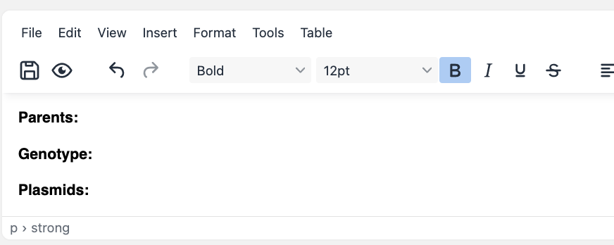
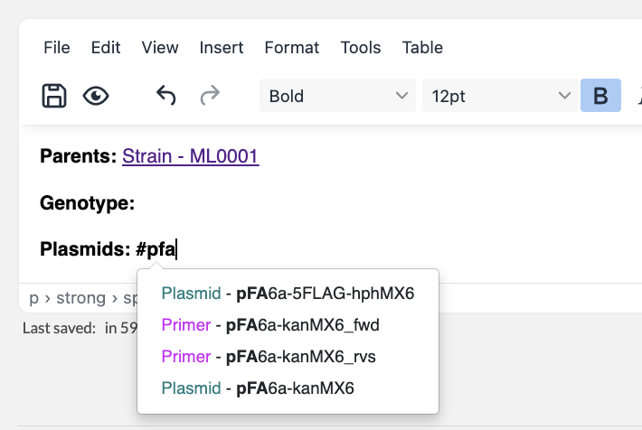
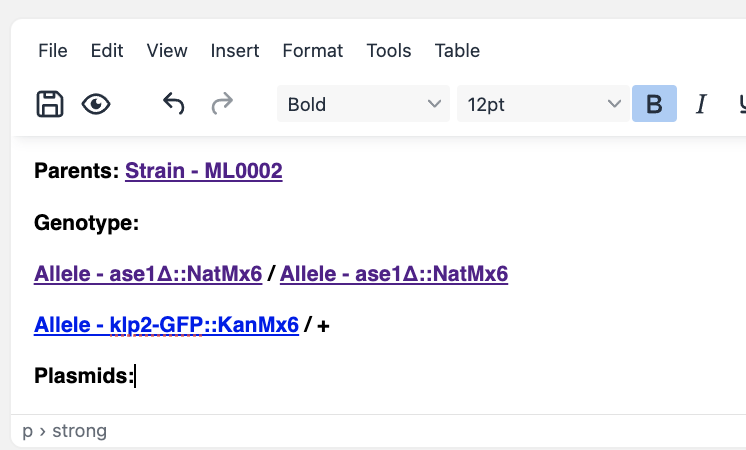

.. _addons:

******
Addons
******

What are addons?
=================

Addons are services that can be deployed to provide extended functionality for eLabFTW. They are not a requirement but are definitely recommended.

Chem Plugin
===========

Description
-----------

The ``chem-plugin`` addon is necessary for two things:

- calculating fingerprint of chemical compounds (which subsequently allows for substructure search)
- enabling all features of the chemical editor

How to install
--------------

Deploy a ``chem-plugin`` container somewhere. It can be on the same server than eLabFTW or some other place. Adding a service to your ``docker-compose.yml`` file is the easiest. See the `example docker-compose.yml file <https://github.com/elabftw/elabimg/blob/e1e5a2da33db11ae8d54924c15a227d6abcd4e43/src/docker-compose.yml-EXAMPLE#L414-L419>`_.

The deployment is really straightforward, as there is nothing to configure. You just start the container and that's it.

.. code:: yaml

     chem-plugin:
        image: elabftw/chem-plugin:latest
        container_name: chem-plugin
        restart: always
        networks:
          - elabftw-net

Next, configure eLabFTW to use that service by adding two environment variables:

.. code:: yaml

    # This service is necessary for the Chemical structure editor (Ketcher)
    - USE_INDIGO=true
    - INDIGO_URL=http://chem-plugin/
    # The fingerprinter is necessary to create a fingerprint of chemical compounds so we can do sub-structure search
    - USE_FINGERPRINTER=true
    - FINGERPRINTER_URL=http://chem-plugin:8000/

In the example above, the container is on the same network as ``elabftw`` container, so we use its name as hostname.

Restart the ``elabftw`` container to take these changes into account.

OpenCloning addon
=================

Description
-----------

`OpenCloning <https://github.com/manulera/OpenCloning>`_ is an application useful to plan and document cloning. It allows loading DNA data from various sources and is tightly integrated with eLabFTW. This means that you can easily use your Resources in eLabFTW and their attached files to perform cloning operations.

How to install
--------------

To enable OpenCloning in eLabFTW, deploy a container like shown in the `example docker-compose.yml <https://github.com/elabftw/elabimg/blob/e1e5a2da33db11ae8d54924c15a227d6abcd4e43/src/docker-compose.yml-EXAMPLE#L421-L432>`_.

Then enable it in ``elabftw`` container configuration:

.. code:: yaml

    # This is for the integration of the DNA Cloning tool
    - USE_OPENCLONING=true
    - OPENCLONING_URL=http://opencloning-plugin:8000/

Restart the ``elabftw`` container to take these changes into account.

How to use
----------

To learn the generic functionality of OpenCloning, please refer to the `OpenCloning documentation <https://docs.opencloning.org>`_. It has support for:

- Importing plasmid sequences from AddGene, iGEM distributions, etc. and genome sequences from NCBI.
- Load your own sequence files.
- Planning cloning and design primers using common techniques (Gibson, golden gate, gateway, etc.).
- Planning strain and cell line engineering via CRISPR and homologous recombination.

Below we cover the features specific to the eLabFTW integration.

Loading resources into OpenCloning
^^^^^^^^^^^^^^^^^^^^^^^^^^^^^^^^^^

Loading a sequence
""""""""""""""""""

To load a sequence in OpenCloning from eLabFTW, you need a resource entry of any type with a sequence file attached. The file can be in various formats like GenBank, FASTA, or SnapGene, and from JSON files created by OpenCloning (they also contain the cloning history).

In the example below, I have a resource entry of type Plasmid called pFA6a-kanMX6-P81nmt1 with a sequence file attached:

.. image:: img/opencloning/sequence-pre-load.png

To load it in OpenCloning, you can go to an empty source, and click on ``Source type`` to select ``Import from eLabFTW``, then select the resource entry you want to load, and the file that contains the sequence.

.. image:: img/opencloning/sequence-load.gif
   :width: 500px
   :align: center

.. note::
   If you created the resource entry using OpenCloning, you can load the JSON file instead, and the cloning history will be loaded automatically.

Loading a primer
""""""""""""""""

To load a primer in OpenCloning from eLabFTW, you need a resource entry that has a field named "sequence" containing the primer sequence. The sequence should be in plain text format and should only contain the characters ``ACGTacgt``. The resource type does not have to be Primer, it can be any other type.

In the example below, I have a resource entry in eLabFTW with a sequence field containing the primer sequence:

.. image:: img/opencloning/primer-pre-load.png
   :width: 500px
   :align: center

To load it in Opencloning, you can go to the ``Primers`` tab, click on ``Import from eLabFTW``, then select the resource entry you want to load. The sequence will be displayed, and you can click on ``Import Primer`` to add it to the session. You can keep on loading primers this way, then close the import section clicking on ``Cancel``.

.. image:: img/opencloning/primer-load.gif
   :width: 500px
   :align: center

Creating resources from OpenCloning
^^^^^^^^^^^^^^^^^^^^^^^^^^^^^^^^^^^

Creating a sequence
"""""""""""""""""""

If you want to save a sequence from OpenCloning as a resource entry in eLabFTW, you can click on the floppy disk icon in the top right corner of the sequence view. There, you will be able to select the resource type and the name.

.. image:: img/opencloning/sequence-save.png
   :width: 350px
   :align: center

When you save the sequence, a new resource entry is created with:

* A GenBank file (.gb) containing the sequence and annotations.
* A JSON file containing the cloning history.
* Links to parent resources stored in the eLabFTW database (sequences and primers, if any).

The sequence border will turn green in the OpenCloning interface, indicating that it is saved in the eLabFTW database, and instead of the floppy disk icon, you will see a link icon. Clicking on it will open the eLabFTW entry in a new tab.

In addition, if your sequence used primers (e.g. if that sequence is a PCR product), OpenCloning will ask you to select a category to save those primers in the database.

* If you leave it empty, resource entries for the primers will not be created, but they will be stored in the JSON file, so they won't be lost.
* If you select a category, a new resource entry will be created for each primer with the same name as the primer in OpenCloning.

.. image:: img/opencloning/sequence-save-with-primers.png
   :width: 350px
   :align: center

You might not want to save certain intermediate sequences as entries in the eLabFTW database (e.g. a PCR product that you used in a Gibson assembly). In that case, you can save the final product (The Gibson assembly product in the example below). The intermediate sequences will be stored in the JSON file, so they won't be lost. If you do that, you will see that only the final product turns green.

.. image:: img/opencloning/sequence-intermediates-example.png

.. admonition:: Should I create sequence resource entries directly in eLabFTW or export from OpenCloning?

   While both approaches work, creating resources in OpenCloning will automatically store provenance information. For instance, for plasmids from AddGene, it stores their unique identifier. For genomic sequences, it stores the assembly and sequence accession numbers as well as the coordinates and gene identifiers. Even if you are loading a sequence from a file, you can drag-and-drop it into OpenCloning, and then save it as a resource entry.

Creating a primer
"""""""""""""""""

In addition to creating primers when you save sequences that use them (as above), you can also save primers by clicking on the floppy disk icon next to them in the OpenCloning interface.

.. image:: img/opencloning/primer-save.png

When you save a primer, a new resource entry is created with a "sequence" field containing the primer sequence. Once saved, you can no longer edit the sequence or name in OpenCloning. You will have to edit the sequence in the eLabFTW entry, and reload the primer in OpenCloning.

Removing resources from the session
^^^^^^^^^^^^^^^^^^^^^^^^^^^^^^^^^^^

OpenCloning cannot delete resource entries from the eLabFTW database. If you have saved a sequence or a primer in the database and you click on the delete icons in OpenCloning, they will be removed from the OpenCloning interface, but the resource entry will NOT be deleted.

Sequencing data
^^^^^^^^^^^^^^^

To load sequencing data from eLabFTW and align it to your resource sequence:

* Save your sequence as a resource entry in eLabFTW
* In eLabFTW, add the sequencing files to the resource entry (attach ab1 files, fastq files, etc.)
* Click on the ``Verification files`` icon on the top right of the sequence
* Click on ``Load from eLabFTW``
* Select the files that contain the sequencing data and click on ``Load``
* Wait for the alignment to finish, then either click on ``See alignments on editor``, or click on the eye icon on the top right of the sequence to see the alignments.

Resource type organization
^^^^^^^^^^^^^^^^^^^^^^^^^^

To manage plasmids and primers, you don't need to do anything else, just follow the above instructions, and OpenCloning will handle the relationships between the resources. If you want to represent cell lines and strains, we recommend the below configuration.

Create at least a resource type for each of the following (the names can be anything you want):

* Allele
* Locus
* Strain and/or cell line

Creating alleles
""""""""""""""""

An allele is a variant of a gene. When describing the genotype of an engineered strain or cell line as text, we list the names of the alleles present in that strain or cell line that differ from the reference genome. We can do something similar in eLabFTW, while keeping track of the provenance of the alleles through links between resource entries.

Let's imagine I want to create a deletion allele for the gene ase1 in a strain of `S. cerevisiae`. One way to do this is through PCR and homologous recombination: use primers containing homologous arms to amplify a plasmid fragment containing a resistance marker, then transform the cells with this PCR product. If this is the first time you create an allele of the ase1 gene in OpenCloning you can do this by:

* Loading the plasmid you will use from eLabFTW (if it's the first time you use it, load it from AddGene or other repository, then save it to eLabFTW).
* Loading the Genome region of interest in OpenCloning via ``Genome region``.
* Design primers containing homologous arms for the ase1 gene (you can do this directly in OpenCloning).
* Perform the homologous recombination.

You should see something like this, where the plasmid is green (saved in eLabFTW) and the rest of sequences are blue (not saved yet in eLabFTW).

Then:

* Save the ase1 locus as a `Locus` resource entry.
* Save the allele as an `Allele` resource entry (you probably do not want to save the PCR product as its own entry, but you can if you want). Follow the nomenclature convention of your discipline for the name of the allele.

Now, whenever you want to create a new allele of the ase1 gene, instead of loading the genome sequence from the NCBI, load your ase1 locus resource entry from eLabFTW instead. Like that, all the alleles generated from this locus will be linked to it, and you can easily find them later.

.. note::
   When loading a locus in OpenCloning via ``Genome region``, you can specify how many bases upstream and downstream of the gene you want to load. By default this is 1000, but you should increase it if you think you will use a larger region for cloning in this locus in the future, since you will keep using the same sequence for all the alleles generated from this locus.

Creating strains and cell lines
"""""""""""""""""""""""""""""""

You must start with a reference strain or cell line. Create a resource, and ideally indicate some unique identifier for it (e.g. catalogue number in a stock center). You can also create a template for children strains / cell lines. Something basic like this:

To represent a cell line / strain that has been transformed with a self-replicating plasmid, simply create a new cell line / strain resource entry, and mention the parent strain and transformed plasmid in the description (using ``#``). This way, the resources will be linked to each other in eLabFTW.

To represent the genotype of a strain / cell line that has been engineered, simply create a new cell line / strain resource entry and mention the parent strain and alleles in the description (using ``#``). To represent  an heterozygous genotype, you can use the ``+`` symbol (or whatever convention is followed in your discipline).

If you are creating new strains through mating, create a new entry referencing both parents, and include the alleles present in the resulting strain.

