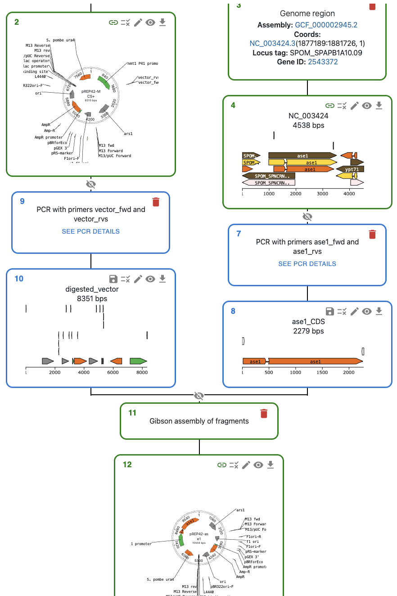

.. _addons:

******
Addons
******

What are addons?
=================

Addons are services that can be deployed to provide extended functionality for eLabFTW. They are not a requirement but are definitely recommended.

Chem Plugin
===========

Description
-----------

The ``chem-plugin`` addon is necessary for two things:

- calculating fingerprint of chemical compounds (which subsequently allows for substructure search)
- enabling all features of the chemical editor

How to install
--------------

Deploy a ``chem-plugin`` container somewhere. It can be on the same server than eLabFTW or some other place. Adding a service to your ``docker-compose.yml`` file is the easiest. See the `example docker-compose.yml file <https://github.com/elabftw/elabimg/blob/e1e5a2da33db11ae8d54924c15a227d6abcd4e43/src/docker-compose.yml-EXAMPLE#L414-L419>`_.

The deployment is really straightforward, as there is nothing to configure. You just start the container and that's it.

.. code:: yaml

     chem-plugin:
        image: elabftw/chem-plugin:latest
        container_name: chem-plugin
        restart: always
        networks:
          - elabftw-net

Next, configure eLabFTW to use that service by adding two environment variables:

.. code:: yaml

    # This service is necessary for the Chemical structure editor (Ketcher)
    - USE_INDIGO=true
    - INDIGO_URL=http://chem-plugin/
    # The fingerprinter is necessary to create a fingerprint of chemical compounds so we can do sub-structure search
    - USE_FINGERPRINTER=true
    - FINGERPRINTER_URL=http://chem-plugin:8000/

In the example above, the container is on the same network as ``elabftw`` container, so we use its name as hostname.

Restart the ``elabftw`` container to take these changes into account.

OpenCloning addon
=================

Description
-----------

`OpenCloning <https://github.com/manulera/OpenCloning>`_ is an application useful to plan and document cloning. It allows loading DNA data from various sources and is tightly integrated with eLabFTW. This means that you can easily use your Resources in eLabFTW and their attached files to perform cloning operations.

How to install
--------------

To enable OpenCloning in eLabFTW, deploy a container like shown in the `example docker-compose.yml <https://github.com/elabftw/elabimg/blob/e1e5a2da33db11ae8d54924c15a227d6abcd4e43/src/docker-compose.yml-EXAMPLE#L421-L432>`_.

Then enable it in ``elabftw`` container configuration:

.. code:: yaml

    # This is for the integration of the DNA Cloning tool
    - USE_OPENCLONING=true
    - OPENCLONING_URL=http://opencloning-plugin:8000/

Restart the ``elabftw`` container to take these changes into account.

How to use
----------

To learn the generic functionality of OpenCloning, please refer to the `OpenCloning documentation <https://docs.opencloning.org>`_. It has support for:

- Importing plasmid sequences from AddGene, Euroscarf, etc. and genome sequences from NCBI.
- Load your own sequence files.
- Planning cloning and design primers using common techniques (Gibson, golden gate, gateway, etc.).
- Planning strain and cell line engineering via CRISPR and homologous recombination.
- Downloading final constructs as GenBank or FASTA files.
- Archiving the entire cloning history in an Open format and load it later.
- Creating reusable cloning templates.

Below we cover the features specific to the eLabFTW integration.

Loading resources into OpenCloning
^^^^^^^^^^^^^^^^^^^^^^^^^^^^^^^^^^

Loading a sequence
""""""""""""""""""

To load a sequence in OpenCloning from eLabFTW, you need a resource entry of any type with a sequence file attached. The file can be in various formats like GenBank, FASTA, or SnapGene, and from json files created by OpenCloning (they also contain the cloning history).

In the example below, I have a `Plasmid` resource entry called `pFA6a-kanMX6-P81nmt1` with a sequence file attached:

To load it in OpenCloning, you can go to an empty source, and click on `Source type` to select `Import from eLabFTW`, then select the resource entry you want to load, and the file that contains the sequence.

.. note::
   If you created the resource entry using OpenCloning, you can load the json file instead, and the cloning history will be loaded automatically.

Loading a primer
""""""""""""""""

To load a primer in OpenCloning from eLabFTW, you need a resource entry that has a field named "sequence" containing the primer sequence. The sequence should be in plain text format and should only contain the characters `ACGTacgt`. The resource type does not have to be `Primer`, it can be any other type.

In the example below, I have a `Primer` entry called `vector_fwd` with a sequence field containing the primer sequence:

To load it in Opencloning, you can go to the `Primers` tab, click on `Import from eLabFTW`, select the resource entry you want to load. The sequence will be displayed, and you can click on `Import Primer` to add it to the session. You can keep on loading primers this way, then close the import section clicking on `Cancel`.

Creating resources from OpenCloning
----------------------------------

Creating a sequence
"""""""""""""""""""

If you want to save a sequence from OpenCloning, you can click on the floppy disk icon in the top right corner of the sequence view. There, you will be able to select the resource type and the name of the entry.

When you save the sequence, a new resource entry is created with:

* A GenBank file (.gb) containing the sequence and annotations
* A JSON file containing the complete history of operations
* Links to parent resources stored in the eLabFTW database (sequences and primers, if any)

The sequence border will turn green in the OpenCloning interface, indicating that it is saved in the eLabFTW database, and instead of the floppy disk icon, you will see a link icon. Clicking on it will open the eLabFTW entry in a new tab.

In addition, if your sequence used primers (e.g. if that sequence is a PCR product), OpenCloning will ask you to select a category to save those primers in the database.
* If you leave it empty, resource entries for the primers will not be created, but they will be stored in the json file, so they won't be lost.
* If you select a category, a new resource entry will be created for each primer. The name of the resource will be the same as the name of the primer in OpenCloning.

You might not want to save certain intermediate sequences as entries in the eLabFTW (e.g. a PCR product that you used in a Gibson assembly). In that case, you can save the final product (The Gibson assembly product in the example below). The intermediate sequences will be stored in the json file, so they won't be lost. If you do that, you will see that only the final product turns green.

.. admonition:: Should I create resource entries by loading files or importing from OpenCloning?

   While both approaches work, creating resources directly from OpenCloning is recommended as it automatically:

   * Creates properly formatted entries with standardized fields
   * Attaches all relevant files (GenBank, FASTA, JSON history)
   * Ensures consistency between the sequence data and metadata
   * Preserves the complete cloning history for future reference

   Only use manual file loading if you're importing sequences from external sources that weren't created in OpenCloning.

Saving a primer
"""""""""""""
You can save primers when you save sequences that use them (see above), or by clicking on the floppy disk icon next to the primer in the OpenCloning interface.

When you save a primer, a new resource entry is created with a "sequence" field containing the primer sequence. Once saved, you can no longer edit the sequence or name in OpenCloning. You will have to edit the sequence in the eLabFTW entry, and reload the primer in OpenCloning.

Removing resources from the session
----------------------------------

OpenCloning cannot delete resource entries from the eLabFTW database. If you have saved a sequence or a primer in the database and you click on the delete icons in OpenCloning, they will be removed from the OpenCloning interface, but the resource entry will NOT be deleted.

Other features
^^^^^^^^^^^^^^

Sequencing data
""""""""""""""

To load sequencing data from eLabFTW, you need a resource entry that has a field named "sequencing_data" containing the sequencing data. The sequencing data should be in plain text format.

Resource type organization
^^^^^^^^^^^^^^^^^^^^^^^^

Best practices for setting up resource types:

Plasmid
"""""""
* Should include fields for:
    * Sequence (attached file)
    * Resistance markers
    * Origin of replication
    * Key features

Allele
""""""
* Should include fields for:
    * Wild-type sequence
    * Mutation description
    * Phenotype

Locus
"""""
* Should include fields for:
    * Chromosomal coordinates
    * Reference genome
    * Associated genes

Strain / cell line
"""""""""""""""""
* Should include fields for:
    * Parent strain/line
    * Genotype
    * Growth conditions
    * Associated plasmids or modifications
