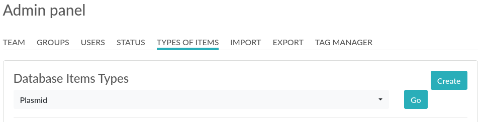

.. _admin-guide:

Admin guide
===========
This guide is intended for Admins of Teams. An Admin is a User in a Team with Admin rights, and access to the Admin Panel (from the top right menu or the bottom left link). A Team can have several Admins and must have at least one.

How to become Admin?
~~~~~~~~~~~~~~~~~~~~
A user is automatically an Admin if they are the first user in a Team. An Admin can promote another user to Admin from the Admin Panel > Users tab. A Sysadmin can promote a User to Admin the same way (frome the Sysadmin Panel).

General overview
~~~~~~~~~~~~~~~~
An Admin:

* Has access to the Admin Panel with settings impacting only their team
* Can validate/edit users of their team
* Can edit available Status for experiments of their team
* Can edit available Items Types for the database of their team
* Can edit the default experiments template
* Can import data from a CSV file in the database
* Can import elabftw.zip archives (experiments or database items)
* Can manage groups of users amongst the team (see below)
* Can change the rightmost link in the main menu (default is Documentation)
* Can archive users. Archiving users means disable login for that account, and lock all experiments.

Validating accounts
~~~~~~~~~~~~~~~~~~~
Unless this setting has been modified by the Sysadmin, new accounts will need validation from a team Admin before they can connect. It is your role as an Admin to validate new users accounts. To do that, head to the Admin panel (link at the bottom left of any page) and you will see the users waiting for validation.

If you do not wish to validate this account because they don't belong in your team, you can either ask the Sysadmin to change the team of this account, or delete the account yourself from the Users tab in the Admin Panel.

Video
~~~~~
If you prefer, you can watch a short video introducing the Admin Panel:

.. raw:: html

   <iframe width="560" height="315" src="https://www.youtube.com/embed/EyEX9nHNWsk" frameborder="0" allow="accelerometer; autoplay; encrypted-media; gyroscope; picture-in-picture" allowfullscreen></iframe>

TEAM tab
~~~~~~~~
The first tab of the Admin Panel contains various settings for the Team.

GROUPS tab
~~~~~~~~~~
The Admin can create User Groups from the Admin Panel. Once a User Group is created, the Admin can add Users to this group by typing their name in the input field and selecting the suggested User. Users that are part of a User Group can then choose to set the permissions of an item/experiment to this group. Only members of this group will be able to see/edit this entry.

Note that it is possible to assign members from other Teams in a group.

USERS tab
~~~~~~~~~
The Users tab allows you to modify user accounts in your team. From this page, you can reset a password directly or "Archive" an user. An "archived" user won't be able to login anymore and all of their experiments will be locked. If the user needs to be in another team, the correct procedure is to archive the user in the first team, and create a new account (same email) in the new team. This way the first team keeps the data, and the user can have a fresh account in the new team with the same email.

You can also disable multifactor authentication for a particular user, if needed.

At the bottom, you can add directly a new user in your team. The new user will need to activate the "Reset password" functionality to access their account.

STATUS tab
~~~~~~~~~~
Like items types, status are entirely editable and you can customize them to your liking.

TYPES OF ITEMS tab
~~~~~~~~~~~~~~~~~~
This is where you can configure the categories available in the main Database tab. You can have as many as you want. For instance:

* Antibody
* Cell line
* Microscope (make sure to make it bookable so it can be used in the Scheduler of the Team tab)
* Protocol (or you might prefer to use templates for that)
* Computer
* Software
* Project
* Plasmid
* ...

Select a category and click "Go" to load it. Or click "Create" to add a new category.




When you create a new category, use the default template of that type of item to add fields. For instance, for a Plasmid category you might want to have:

**Concentration:**

**Backbone:**

**Resistance bacteria:**

**Resistance mammalian:**

You can also have a look at using :ref:`extra fields <metadata>` defined through the metadata json editor so all items created in that category will have these supplementary inputs.

IMPORT tab
~~~~~~~~~~
If you already have some "items" catalogued in an Excel file or File Maker database, you can import them from this tab. To achieve a successful import, make sure to follow these instructions:


1. Preparing the file
`````````````````````

It is important to make sure that the file you are going to import is "clean". Open your file (.xls/.xlsx/.ods/.csv) in an editor like LibreOffice Calc or Microsoft Excel.

Make sure that there are now empty rows or extra information outside the main data. And that you don't have columns with the same name, or columns with no useful information.

You should have a number of columns and rows, looking something like that:

.. list-table:: Example antibodies dataset
   :header-rows: 1

   * - Name
     - Host
     - Target
     - Reference
     - Seller
     - Storage
   * - Anti α-actin
     - Mouse
     - Human
     - AB3148
     - Abcam
     - -20°C
   * - Anti γ-tubulin
     - Rabbit
     - Human
     - AB1337
     - Abcam
     - +4°C


Now you need to have a column named **title**. This is the column that will be picked up as the title of the eLabFTW entry once imported. This column doesn't necessarily needs to be the first one, but it needs to be there. Here we're going to change the "Name" column. So now it looks like this:


.. list-table:: Example antibodies dataset modified
   :header-rows: 1

   * - title
     - Host
     - Target
     - Reference
     - Seller
     - Storage
   * - Anti α-actin
     - Mouse
     - Human
     - AB3148
     - Abcam
     - -20°C
   * - Anti γ-tubulin
     - Rabbit
     - Human
     - AB1337
     - Abcam
     - +4°C

Once you are satisfied with the file, export it as a **.csv** (in File > Save as...). Make a copy of only the first 3 rows and export that too as csv, this will be our test file.

2. Importing the file
`````````````````````

Go to the Admin Panel. If you haven't done it already, create first an Item Type that fits your data. Here we will create an "Antibody" category as that's what we are importing, from the "Items Types" tab.

Now go to the Import tab. Select the correct category (Antibody in this example). Then select the visibility. The delimiter to select will depend on which software you used and your regional preferences. LibreOffice gives you the choice of this separator. Look at your CSV file to determine which one you have if you don't know. Now select your **test** CSV file (with a few rows only) and click the "Import CSV" button.

Every row will correspond to an entry in the correct category of database items. All the columns (except title) will be imported in the body of each entry.

If the import looks good, you can now delete these newly imported items and import your complete file.

Using the API to control how things are imported
````````````````````````````````````````````````

If you want to have complete control over the import process, you can use a helper program to do the import.


.. code-block:: python

    #!/usr/bin/env python
    import elabapy
    import csv

    manager = elabapy.Manager(token="YOUR_TOKEN", endpoint="https://elabftw.example.org")

    with open('a.csv', newline='') as csvfile:
        csvreader = csv.DictReader(csvfile, delimiter=',', quotechar='"')
        for row in csvreader:
            res = manager.create_experiment()
            # start by clearing out the content (default template)
            manager.post_experiment(res['id'], {'body': ''})
            # add a title
            manager.post_experiment(res['id'], {'title': row['title']})
            # now create a body with columns in bold
            manager.post_experiment(res['id'], {'bodyappend': '<strong><h2>Content:</h2></strong>' + row['content'] + '<br>'})
            manager.post_experiment(res['id'], {'bodyappend': '<strong><h2>Category:</h2></strong>' + row['category'] + '<br>'})
            manager.post_experiment(res['id'], {'bodyappend': '<strong><h2>Elabid:</h2></strong>' + row['elabid'] + '<br>'})


EXPORT tab
~~~~~~~~~~
This tab allows you to Export experiments, items or scheduler bookings in various formats.

TAG MANAGER tab
~~~~~~~~~~~~~~~
This interface allows an Admin to edit the existing tags if needed. For instance, if you have "RPE1" and "RPE-1" and you want all the tags to be in the form "RPE-1", find the "RPE1" tag, click on it to edit it to "RPE-1", and click the Deduplicate button.
