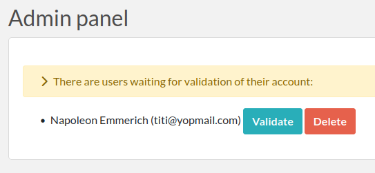

.. _admin-guide:

***********
Admin guide
***********
This guide is intended for Admins of Teams. An Admin is a User in a Team with Admin rights, and access to the Admin Panel (accessed via the top right menu). A Team can have several Admins and must have at least one.

How to become an Admin?
=======================
A User is automatically an Admin if they are the first User in a Team. An Admin can promote another User to the Admin level from the Admin Panel > Users tab. A Sysadmin can promote a User to the Admin level in the same way (from the Sysadmin Panel).

General overview
================
From the Admin Panel, an Admin can:

* generate a CSV report of usage per user
* change settings related to the Team internal organization
* setup onboarding email sent to new users
* add an informative banner for new users
* create groups of users
* manage members of the team: validate accounts or change validity date
* manage tags
* execute actions in batch

Validating accounts
===================
Unless this setting has been modified by the Sysadmin, or provisioning is done automatically, new accounts will need to be validated by a Team Admin before new Users can connect. The Admin is responsible for validating new User accounts. To validate new Users, head to the Admin panel where you will see a list of Users waiting for validation.

If you do not wish to validate an account because that User does not belong to your Team, you can either ask the Sysadmin to change the Team associated with that account, or delete the account yourself.

TEAM tab
========
The first tab in the Admin Panel contains various settings for the Team. This is where you can configure what Users can or cannot do in the Team, and settings related to new users.

USER GROUPS tab
===============
The Admin can create User Groups from the Admin Panel. Once a User Group is created, the Admin can add Users to this Group by typing their names in the input field and selecting the suggested Users. Users in a Group can set the permissions of a Resource/Experiment for that Group such that only members of the Group can see/edit an entry.

Note that it is possible to add Users from other Teams to a User Group.

USERS tab
=========
The Users tab allows limited modification of User accounts member of the Team. Double-click a row in the table to edit the "Valid until" parameter of a user account. If you were give the rights by the Sysadmin, you can possibly manage the association between users and teams, too.

From this page, you can also directly add a new User to your Team, if the Sysadmin allows it. The new User will need to activate the "Reset password" functionality to access their account.

EXPORT tab
==========
This tab allows you to export Experiments, items, or scheduled bookings in various formats.

TAG MANAGER tab
===============
This interface allows an Admin to edit existing Tags. For instance, if you have Tags called "RPE1" and "RPE-1" and you want all of the Tags to be in the form "RPE-1", find the "RPE1" Tag, click on it to edit it to "RPE-1", and click the Deduplicate button.

BATCH ACTIONS tab
=================
This tab allows you to execute actions on many items at once. For instance, changing the visibility of all experiments from a given user, or a given category.
