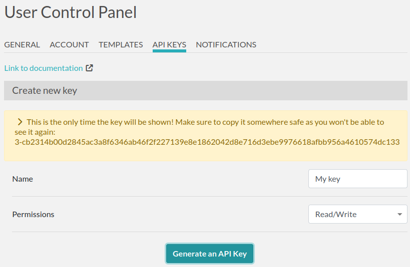

.. _api:

***
API
***

What's that?
============

It's a way to read or write data to eLabFTW from an external program (like a Python script).

For instance, instead of using a web browser to access the web interface and create an experiment,
you make a call to the API saying "hey, create an experiment for me", and the api will reply with the ID of the newly created experiment.

It can be used to directly feed data to eLabFTW, coming from a piece of equipment for instance.

Getting started
===============

Generating a key
----------------

In order to use the API, you need to generate an API key. Head to the Settings page and create a new key by giving it a name and access level:

Protect this key like you would do with a password, as it gives access to your account!

Basic request
-------------

The public API works with HTTP requests, so you are free to use any technology capable to make HTTP requests, which basically includes everything under the sun.

A simple tool to get started is `curl` (most likely already available if using a GNU/Linux system). Here is how to fetch data of experiment with ID 42:

.. code-block:: bash

   export KEY=3-cb2314b00d2845a...
   curl -H "Authorization: $KEY" https://eln.example.org/api/v2/experiments/42

What we've done is use ``curl`` to make a ``GET`` request to eLabFTW api v2 endpoint. Sending the key in the ``Authorization`` header, and specifying that we want the experiment with id 42 in the URL. The response is a JSON object.

Mainly, the API is using HTTP verbs for different actions. ``GET`` to read things (will not modify anything), ``POST`` to create things, ``PATCH`` to modify things, ``DELETE`` to, you guessed it, delete things.

For instance, to create an experiment:

.. code-block:: bash

   curl -I -H "Content-Type: application/json" -H "Authorization: $KEY" -X POST https://eln.example.org/api/v2/experiments

The response headers contain the URL to the created resource in the ``location`` header:

.. code-block:: text

    HTTP/2 201
    content-type: text/html; charset=UTF-8
    location: https://eln.example.org/api/v2/experiments/321
    ...other headers...

You can then ``PATCH`` that newly created entry with whatever attributes you wish to change (title, date, main text, tags, etc...):

.. code-block:: bash

   curl -H "Content-Type: application/json" -H "Authorization: $KEY" -X PATCH -d '{"title": "created from api", "date": "2024-02-15", "body": "main text content"}' https://eln.example.org/api/v2/experiments/321

Everything is described in the `documentation <https://doc.elabftw.net/api/v2/>`_ generated from the specification.

You'll probably want to use python or a shell language to build a more meaningful script. Fortunately, a `python library <https://github.com/elabftw/elabapi-python>`_ is available to make things easy for you (look at the `examples` folder!).

Read the doc
============

The complete documentation of all endpoints with code examples is available here: `elabftw's API documentation <https://doc.elabftw.net/api/>`_.
