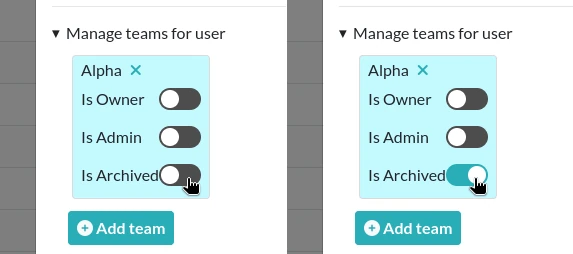

.. _coordinator-guide:

*****************
Coordinator guide
*****************

What is an Instance Coordinator
===============================

An instance coordinator helps manage the users in an instance. For example, they may add and remove users from different teams, and help to implement exit strategies for users and data. More information about the utility of this role and helpful strategies will be added soon!

Training sessions
=================

As an instance coordinator, it is a good idea to organize training sessions for users. You can either opt for Deltablot's training session or make one yourself. It can also just be a discussion with users about their use of the software and the difficulties they might have with it and how to address them.

Internal exchange
=================

In order to help users, we recommend making available a place for everyone to exchange on eLabFTW. It could be a Slack/Teams/Mattermost channel, or a forum or anything else that is easy to access for everyone involved. They can use this place to ask questions directly to the coordinator.

Different strategies for managing users in teams
================================================

When a user leaves a team
-------------------------

In eLabFTW, there are currently several options for handling the data of users who are about to leave a team. Here are a few exit strategies to consider:

A. The User is completely gone
^^^^^^^^^^^^^^^^^^^^^^^^^^^^^^

If someone stopped working in the lab and will likely not come back, archiving them is the best option. It prevents them from using their account while still allowing other team members to see their past work.

From the Admin Panel, double-click a User from your team and toggle the section "Manage teams for user". From there, you can Archive someone by toggling the "Is Archived" property of the User in the team.

Note that the Archived status of a User is team-dependent, meaning that a User can be archived in a Team and not in another.

   Archiving a user

B. The User joins another team
^^^^^^^^^^^^^^^^^^^^^^^^^^^^^^

As a Sysadmin or an Admin with "Can manage users/teams association" permissions, add the User to the new Team and Archive them in the old one. If they still need access to their old entries, they can export them from their Profile page and re-import them in the new team, or you can leave the account active in both teams, depending on use case.
