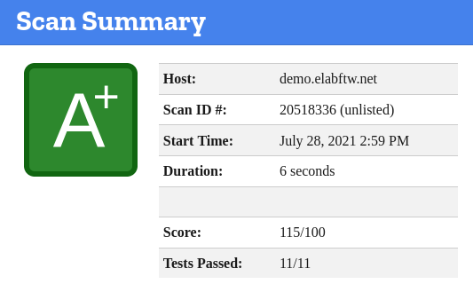
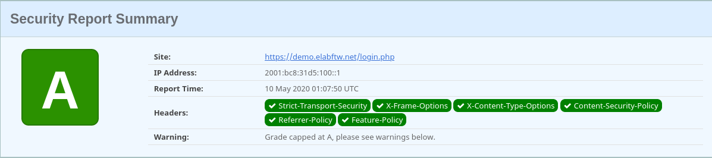
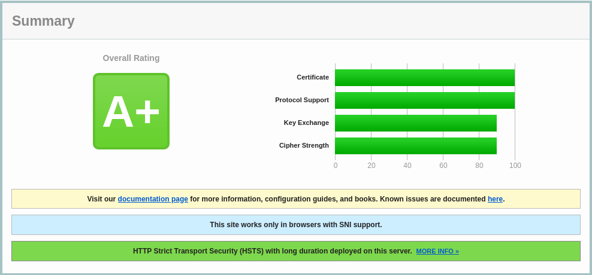

.. _docker-doc:

About Docker
------------

.. image:: img/docker.png
    :align: center
    :alt: docker

Introduction
````````````
This page explains the containerization technology in broad strokes.

eLabFTW works with containers (`wikipedia <https://en.wikipedia.org/wiki/Container_(virtualization)>`_). The `official image <https://hub.docker.com/r/elabftw/elabimg>`_, from which containers will be created, bundles everything eLabFTW needs to run. This workflow can be managed by `Docker <https://www.docker.com/>`_ with `docker-compose <https://docs.docker.com/compose/install/>`_ or `Podman <https://podman.io/>`_ with systemd services.

One of the main advantages of using the containerization technology is to allow you to run eLabFTW without modifying the configuration of your server. By using the official image you don't have to worry about missing php extensions, wrong php version or misconfigurations of the server because everything was configured for you beforehand. It's also **much easier to upgrade** and keep your installation up to date and secure.

On the development side, it facilitate many things as it gives more control to the application environment to the developers.

Finally, the containerization technology is massively used nowadays by cloud/IT companies and you can imagine that there are many good reasons for that.

How does it work?
`````````````````

.. note:: This document is about Docker + docker-compose but the same principles apply to a Podman installation.

The most important file is your docker-compose configuration file (see `example file <https://github.com/elabftw/elabimg/blob/master/src/docker-compose.yml-EXAMPLE>`_). While it is possible to launch containers without docker-compose (by running individual `docker run ...` commands), it is strongly advised to use this `docker-compose.yml` file (or `/etc/elabftw.yml`). It contains all the configuration options needed to customize your instance.

Docker will take care of downloading the official image. In the `image:` part of the configuration, you can target a specific version or branch by specifying a tag. Example: `image: elabftw/elabimg:4.3.0` or `image: elabftw/elabimg:next`. Omitting a tag corresponds to `latest`, which will pull the latest stable version.

Once downloaded, a container is created from the image, and the webserver starts to listen on the specified port for incoming requests. The default configuration also launches a MySQL container from the official MySQL image but it is not mandatory and another MySQL server can be used. Other containers like Redis or PHPMyAdmin can also be launched, depending on the configuration you want.

If you already have let's say an Apache server running and are considering installing eLabFTW along your other PHP projects, know that you can keep your existing Apache installation and use it as a reverse proxy to a Docker container. See the `documentation for reverse proxies <https://github.com/elabftw/elabdoc/tree/master/config_examples>`_.

About the Docker image
``````````````````````
- The eLabFTW Docker image is using `Alpine Linux <https://alpinelinux.org/>`_ as a base OS, so we get a lightweight and secure base.
- `PHP 8 <https://www.php.net/>`_ is used so we get an up to date and fast PHP.
- `Nginx <https://nginx.org>`_ is used so we get the best webserver out there running our app with `HTTP/2 <https://en.wikipedia.org/wiki/HTTP/2>`_ capabilities. A custom nginx is compiled for eLabFTW.

Using the provided Docker image adds security features automatically:

- header X-Frame-Option
- header X-XSS-Protection
- header X-Content-Type-Options
- header Strict-Transport-Security
- header Content-Security-Policy to prevent XSS
- use Diffie-Hellman for key exchange with 2048 bits parameter
- use modern cipher suite and protocols for SSL. This will result in an A rating on `SSLLabs <https://www.ssllabs.com/ssltest/>`_, as you can see below.
- custom secure php configuration
- custom secure nginx configuration
- have a score of 115/100 on `Mozilla's Observatory <https://observatory.mozilla.org/>`_:




Test scan of an eLabFTW install at `SecurityHeaders.io <https://securityheaders.io>`_:



Test scan of an eLabFTW install at `Qualys SSL labs <https://www.ssllabs.com/ssltest/>`_:



Just for fun, try to use these two websites to scan the sites of other services you might use or consider using. You'll see a lot of F marks… I'll let you draw your own conclusions from that ;)

You don't have to be a specialist in web security to see that some services are completely insecure and should be avoided. There is a reason why cybercrime makes millions of dollars, a lot of companies have outdated installations and never follow good practices.

While full security can never be completely achieved when it comes to web and computers, with eLabFTW at least you have the best possible setup to mitigate or stop the most commons attacks. Especially if you use a Docker container.

Why can't I run it outside Docker
`````````````````````````````````

While there might be valid use case for running eLabFTW without containers (example: running a BSD operating system), a choice have been made to completely drop support for non-Docker installations.

An application like eLabFTW is highly complex and composed of many parts. Using a container removes variability and prevents misconfigurations and bugs. There are so many ways to run a PHP app that it quickly becomes an impossible task to correctly test for all use cases. Having to support two kind of installs (with and without Docker) adds complexity to the code and documentation.

**Real world reasons that motivated this choice:**

* users running eLabFTW without proper security headers in the webserver config
* issues related to a different webserver (eLabFTW uses nginx)
* issues related to different operating systems
* unnecessary complexity in the code to check if things are available and support different configurations
* unnecessary documentation work for non-Docker users
* high time cost of upgrading for sysadmins due to dependencies updates (example: installing new php version) leaving instances out-of-date
* all the positive aspects of running containers, as described above

Running an eLabFTW instance in Docker doesn't mean there will never be any issue, but at least it reduces greatly the "bug surface".
