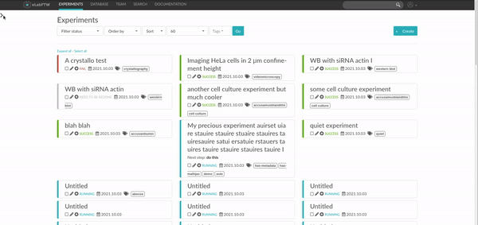

.. _faq:

Frequently asked questions
==========================

Is it totally free?
-------------------

YES. eLabFTW is free/libre software, so it is totally free of charge and always will be. `Read more about the free software philosophy <https://www.gnu.org/philosophy/free-sw.html>`_.

But how is it better than something I can buy?
----------------------------------------------

The difference is huge. Because eLabFTW is not only free (as in beer), but it is free (as in speech). This means that you can have a look at the code (and improve it) and you can also redistribute the code with your improvements.

But more importantly, you cannot trust your data with something that acts like a **black box**. What if the data you upload on the server of a company can be read by someone else? With eLabFTW, you install it on your own server, and you are the master of your data at all time.

What about patents and intellectual property?
---------------------------------------------

Since March 2013, the USA modified their law (see `America Invents Act <https://www.uspto.gov/patent/laws-and-regulations/leahy-smith-america-invents-act-implementation>`_) to switch from first-to-invent to first-inventor-to-file. This means that proving that you did this experiment before someone else has become less critical. It is only needed if you invented something, before someone put a patent on it (and you can prove it), and you want to keep using it as **prior user**.

Fortunately, eLabFTW allows rock solid `timestamping of your experiments <https://en.wikipedia.org/wiki/Trusted_timestamping#Trusted_.28digital.29_timestamping>`_. With just one click of a mouse, and for free, you can timestamp your work.

If needed, you can also choose another TimeStamping Authority allowing :rfc:`3161` timestamping.

You also have the possibility to use the `Bloxberg.org <https://bloxberg.org/>`_ blockchain to timestamp your data. All it takes is a single click!

Why use eLabFTW?
----------------

* **It's free and open source software**
* It improves the value of your experiments by allowing you to keep a good track of it
* It makes searching your data as easy as a google search
* Everything can be organized in your lab
* It makes it easy to share information between co-workers or collaborators
* It is simple to install and to keep up to date
* **It works for Windows, Mac OS X, Linux, BSD, Solaris, etc…**
* Protected access with login/password (password is very securely stored as salted SHA-512 sum)
* It can be used by multiple users at the same time
* **It can be used by multiple teams**
* You can have templates for experiments you do often
* **You can export an experiment as a PDF**
* **You can timestamp an experiment so it is legally strong**
* You can export one or several experiments as a ZIP archive
* You can duplicate experiments in one click
* There is advanced search capabilities
* You can write in Markdown
* The tagging system allows you to keep track of family of experiments
* Experiments can have color coded statuses (that you can edit at will)
* You can link an experiment with an item from the database to retrieve in a click the plasmid/sirna/antibody/chemical you used
* And it works the other way around, you can find all experiments done with a particular item from the database!
* There is a locking mechanism preventing further edition
* You can comment on an experiment (if it's not your experiment)
* You can import your old database stored in an excel file
* You can use it in your language
* :doc:`and much more… <features>`

You also have to consider the fact that installing eLabFTW on your own server means that no one will be able to snoop on your data. If you have ever used Evernote or basically any online ELN that says «Free», read carefully the privacy policy, you might be surprised what they allow themselves to do under the cover of «to improve your experience»…


Is this system stable? Can I trust my data with it?
---------------------------------------------------

Yes. It is used in numerous research centers all over the world since a few years now and if an issue is found it is quickly reported and fixed.

However, having an automated :ref:`backup <backup>` strategy is mandatory in order to be sure **nothing will be lost**.

Being able to do backups is yet another advantage over paper (you can't backup paper!).

Who else is using it?
---------------------

Here are some places running eLabFTW (non-exhaustive list):

* Cardiff University
* Hannover Medical School
* Helmholtz Zentrum Berlin für Materialien und Energie GmbH
* Indian Institute of Science, Bangalore
* Indian Institute of Technology, Delhi
* INRIA
* Institut Curie
* Karolinska Institutet
* Kuwait University
* Max-Planck-Institute of Quantum Optics
* Texas Tech University
* UMC Utrecht
* University of Alberta
* University of California
* University of Chicago
* University of Helsinki
* University of North Dakota
* University of Tennessee
* University of Warwick
* Uppsala University
* Washington University
* Weizmann Institute
* Many many more...

Is the data encrypted?
----------------------

The data is encrypted when travelling from your browser to the server with the highest quality encryption currently available (TLSv1.2 with modern ciphers).

The passwords are not recoverable in case of a breach and are hashed using state of the art algorithms.

Only manually validated accounts can interact with the software. It is secure by default.

Is eLabFTW still maintained?
----------------------------

As of |today| I'm still actively working on it. Improvements are coming in a steady flow. There are good chances that I will continue to do so for a few years. In the unlikely event I'm not able to work on it anymore, anyone can continue the work, as the source code is available and well commented.

Since 2019, the company `Deltablot <https://www.deltablot.com>`_ exists to provide support and hosting to eLabFTW users around the world. This company will allow funding further development of the software thanks to an original business model: the software itself is entirely free, but the individual support, custom features development and hosting are paid options.

If you are interested in such options, please visit this page: `Deltablot's elabftw page <https://www.deltablot.com/elabftw/>`_.

Will I be able to import my plasmids/antibodies/whatever in the database from a Excel file?
-------------------------------------------------------------------------------------------

Yes, in the admin panel, click on the Import CSV link and follow the instructions.

Can I try it before I install it?
---------------------------------

Sure, there is a demo online here: `eLabFTW live DEMO <https://demo.elabftw.net>`_

What are the technical specifications?
--------------------------------------

eLabFTW is a server software that should be installed on a server.

Requirements for the server
```````````````````````````

**Hardware**

At least 2Gb of RAM, a decent processor (> 2GHz), preferably multi-core and an SSD disk with at least a few Gb free.

**Software:**

The operating system of the server can be any but GNU/Linux is highly recommended.

The service runs in `Docker <https://www.docker.com>`_ containers.

A MySQL database service is required. You can create one with Docker following the standard installation procedure, or use an existing one.

Requirements for the clients (users)
````````````````````````````````````

- Any operating system with any browser (recent version), except Safari (might have issues) or Internet Explorer (will have issues).

What about data retention/traceability
--------------------------------------

When a user is making a change to an experiment, a copy of the previous version is kept in the database. This copy cannot be altered by anyone. The admin can also prevent users from deleting experiments, and the creation date is kept in memory, even if the date field is changed later on.

Is it compliant to 21CFR Part 11?
---------------------------------

1. Closed system: eLabFTW requires unique credentials to access the system. A system of permissions and roles allow fine control of what can be seen by whom.

2. Experiments and database items (protocols, reagents, cell lines...) are considered signable by the locking mechanism that timestamps and locks an entity in place.

3. Trusted timestamping: RFC3161 Trusted Timestamping is available for experiments. A specific PDF is generated and timestamped cryptographically to prove anteriority if needed in a court of law.

4. Audit trail: changes to entries are internally recorded and cannot be tampered with by users. A version history is available.

5. Retention of records: a setting allows to disable the possibility to delete records entirely.

6. Copies of records: you can export your data in PDF, ZIP archives or CSV files very easily.

7. Password policy: passwords are securely stored in the database and security mechanisms such as preventing too many authentication tries are in place.

What about compliance to standards?
-----------------------------------
eLabFTW tries to comply to the following standards :

* `Code of Federal Regulations Title 21, paragraph 11 <http://www.accessdata.fda.gov/scripts/cdrh/cfdocs/cfcfr/CFRSearch.cfm?CFRPart=11>`_
* `FERPA <http://www2.ed.gov/policy/gen/guid/fpco/ferpa/index.html>`_
* `HIPAA <http://www.hhs.gov/ocr/privacy/>`_
* `FISMA <https://en.wikipedia.org/wiki/Federal_Information_Security_Management_Act_of_2002#Compliance_framework_defined_by_FISMA_and_supporting_standards>`_

How to have folders or projects grouping experiments?
-----------------------------------------------------

First, try to go beyond the nested, tree-like structure of hierarchical folders.

Imagine you have an experiment which is:

- about "Protein MR73"
- using "Western blot"
- an external collaboration
- with "HEK cells"

Now if that experiment was a file, you might want to store it in "Collaborations > Western Blot > MR73" maybe. Or "Project MR73 > Collaborations > HEK"?

But what if you have another one that is also using HEK cells but has nothing in common with the previous one. How would you go about looking for all the experiments with HEK? And all the experiments related to MR73 that involve a Western Blot?

In a traditional folder structure, you would need to search for it in almost each sub-folders.

Enter **tags**.

Tags
````

Tags are a way to label your experiments (and database objects) with defined keywords and you can have as many as you want!

.. image:: img/tags-view.png
    :align: center
    :alt: tags

Now with the experiments correctly tagged, finding them through different search angles become easy!

Favorite tags
`````````````

Over time, you will have some tags that become your favorites, as they are always the ones you look for for a set of experiments.

Since version 4.2.0 it is possible to define "Favorite tags" that will appear in the left pane of the page listing entries. It allows quick overview of related entries. You should try this feature, start by clicking the arrow on the left of the screen to toggle the left pane. Click the + button and start typing a tag to add it to the list of Favorite tags.




Using Projects
``````````````

There is also another way to group experiments together, that you can use along with tags. It's using a database item of type : Project.

Go to the Admin Panel and create a type of item: "Project". Go to the Database tab and create a new "Project" describing a group of experiments, a project. Go to the Experiments tab and create an experiment. In the field "Link to database", type the name of the project and click on the autocompletion field appearing, and press enter (or click outside). This experiment is now linked to the project. So you can easily go to the project description from the experiment, but more importantly, you can from the Project entry, click the "Show related" icon (chainlink) and display all experiments linked to this project!

Make sure to create experiments templates that already link to that Project so the link will always be here when the experiment is created by a user.

How to change the team of a user?
---------------------------------

There is two ways to do that:

* if the user registered in the wrong team, the Sysadmin can simply change the team from the Sysadmin panel
* if the user switched team, old team needs to Archive the user (from the Admin panel), and user needs to register a new account (same email can be used) in the new team

Can I change the date format?
-----------------------------

No. The date in eLabFTW (YYYYMMDD) follows ISO 8601 standard and allowing a user to change the format would only bring confusion.

.. _faq2fa:

What App can I use for two-factor authentication (2FA) and what settings are used?
----------------------------------------------------------------------------------

It should be possible to use nearly any available 2FA app (`Play Store <https://play.google.com/store/search?q=2FA&c=apps>`_ and `App Store <https://theappstore.org/search.php?search=2fa&platform=software>`_) that supports the time-based one-time password algorithm (TOTP). Setting up 2FA is very easy, you only need to scan the QR-code. Alternatively, a manual set-up is possible with the provided secret. eLabFTW employs commonly used settings (HMAC-SHA-1 algorithm, 6 digits and a period of 30 seconds). Under the hood eLabFTW uses the `PHP library for Two Factor Authentication <https://github.com/RobThree/TwoFactorAuth>`_.

What is the meaning of 'FTW'?
-----------------------------

One of those:

- For The World
- For Those Wondering
- For The Worms
- Forever Two Wheels
- Free The Wookies
- Forward The Word
- Forever Together Whenever
- Face The World
- Forget The World
- Free To Watch
- Feed The World
- Feel The Wind
- Feel The Wrath
- Fight To Win
- Find The Waldo
- Finding The Way
- Flying Training Wing
- Follow The Way
- For The Wii
- For The Win
- For The Wolf
- Free The Weed
- Free The Whales
- From The Wilderness
- Freedom To Work
- For The Warriors
- Full Time Workers
- Fabricated To Win
- Furiously Taunted Wookies
- Flash The Watch
