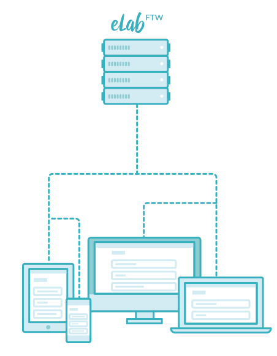

.. elabftw documentation master file, created by
   sphinx-quickstart on Fri Jul 24 17:28:23 2015.

.. image:: img/elabftw-logo.png
    :align: center
    :alt: elabftw logo

Welcome to elabftw's documentation!
===================================

* `Website <https://www.elabftw.net>`_
* `Live demo <https://demo.elabftw.net>`_
* `Git repo <https://github.com/elabftw/elabftw>`_

Introduction
------------

eLabFTW is a PHP application using MySQL to store data persistently. Once installed on a server, users can register an account and start using their electronic lab notebook.

Several teams can be hosted on the same install. Ideally, it is installed at the institution/company level. But individual teams can install it for themselves, too. Or you can run it locally on your computer.

It is distributed through Docker images, ensuring portability and added security. See the :doc:`Docker documentation <docker-doc>` for more infos.

Check out the :doc:`list of features <features>`.

See :doc:`this page <install>` to install it on your server.

See :doc:`this page <install-drop>` if you don't own a server already.

.. toctree::
    :caption: Installation

    install
    install-drop
    install-mac
    install-windows
    install-oldschool
    install-freebsd

.. toctree::
    :caption: Usage

    postinstall
    manual
    backup
    how-to-update

.. toctree::
    :caption: Documentation

    contributing
    faq
    features
    docker-doc
    upgrade-to-docker
    api
    saml

.. toctree::
    :caption: Miscellaneous

    thanks
    changelog
    license
