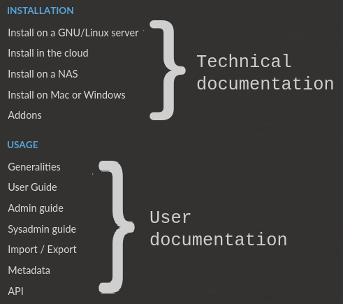

.. elabftw documentation master file, created by
   sphinx-quickstart on Fri Jul 24 17:28:23 2015.

*****************************************
Welcome to the documentation for eLabFTW!
*****************************************

.. image:: img/elabftw-logo.png
    :align: center
    :alt: elabftw logo

:Website:  https://www.elabftw.net
:Live demo: https://demo.elabftw.net

========================

How to use this site
====================

This website contains both the technical documentation for installation, configuration and maintenance of the application, and the user documentation. Look at the menu on the left and select where you want to go:

========================

Introduction
============

eLabFTW is a web application, running in a linux container and using a MySQL database to store data persistently. Once installed on a server, users can register an account and start using their electronic lab notebook.

Several teams can be hosted on the same install. Ideally, it is installed at the institution/company level. But individual teams can install it for themselves, too. Or you can run it locally on your computer, though this is not advised.

It is distributed through Docker images, ensuring portability and added security through containerization. See the :doc:`Docker documentation <docker-doc>` for more information about the containerization technology.

If you're looking into what eLabFTW can do before installing it, you might be interested in the :doc:`list of features <features>`.

Start the installation
----------------------

See :doc:`this page <install>` to install it on your server.

See :doc:`this page <install-cloud>` if you don't have access to a server already.

Join the `chat room <https://gitter.im/elabftw/elabftw>`_ if you want to ask a question or require help.

 .. image:: img/by-sa.png
    :align: center
    :alt: cc-by-sa

.. toctree::
    :caption: Installation

    install
    install-cloud
    install-nas
    install-nolinux
    addons

.. toctree::
    :caption: Usage

    generalities
    user-guide
    admin-guide
    sysadmin-guide
    coordinator-guide
    import-export
    inventory
    metadata
    api
    opencloning

.. toctree::
    :caption: Documentation

    backup
    how-to-update
    contributing
    faq
    features
    docker-doc
    upgrade-to-docker
    ldap
    saml
    debug

.. toctree::
    :caption: Miscellaneous

    thanks
    changelog
