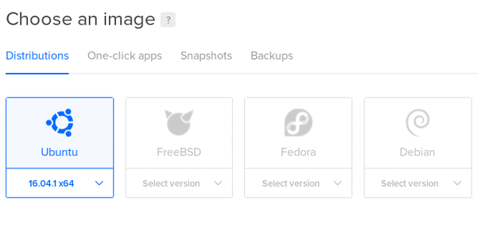

.. _install-cloud:

Install in the cloud
====================

If you do not wish to opt for the hosted solution (`PRO Hosting from Deltablot <https://www.deltablot.com/elabftw>`_), you can install and manage your own eLabFTW instance on a Virtual Private Server (VPS).

A VPS is a shared server which looks like a dedicated server to you. Meaning you get root level access and can do what you want with it.

**Pros**:

* you have complete control on your server and thus your data
* it will only cost you the price of the server, which can be as low as 5$ a month + the domain name (a few $ per year)
* you'll improve your GNU/Linux administrator skills and knowledge
* on the same server you can install other software, like a wiki, a forge, a chat app, etc...
* you'll unleash your inner geek

**Cons**:

* if you mess up you can only blame yourself
* you'll have to keep your instance updated and read the release notes
* you'll have to manage your own backups (and test them!)
* you'll be exposed to malicious actors trying to break into your server constantly
* managing correctly a GNU/Linux server requires administration skills and knowledge

Your eLabFTW installation will run in a `Docker <https://www.docker.com>`_ container. Learn more about eLabFTW in Docker :ref:`here <docker-doc>`.

If you don't have a domain name already, you can get one from `OVH <https://www.ovh.com>`_, `Gandi <https://www.gandi.net>`_, `1&1 <https://www.1and1.com>`_ or any other domain name registrar. You can get one for half a dollar per year. It is required to have a domain name to run eLabFTW.

.. note:: If you don't want to deal with server administration or domain names and all these things, have a look at `PRO Hosting from Deltablot <https://www.deltablot.com/elabftw>`_

Create your droplet
-------------------

.. warning:: A proper subdomain is required. Subfolder install is not supported!

* Create an account on `DigitalOcean <https://m.do.co/c/c2ce8f861e0e>`_. Use this referral link to have 100$ offered!

* Alternatively, you can use `Vultr <http://www.vultr.com/?ref=7164540>`_. Use this referral link to register an account! The rest of this tutorial is for DigitalOcean.

.. image:: img/digitalocean.png
    :align: center
    :alt: digitalocean logo

* Create a droplet with Docker (from the One-click Apps tab), select a size and a region.

* Optional: enable backups (might be a good idea)

* Optional but highly recommended: add your SSH key (`documentation <https://docs.digitalocean.com/products/droplets/how-to/add-ssh-keys/>`_)

* Create the droplet (it takes less than a minute)

* Copy the IP address

* Go to the control panel of your domain name provider. Point your domain (or subdomain) to the IP address of your drop. It might take a bit of time for the DNS to propagate (a few hours).

Install eLabFTW
---------------

* Open a terminal and connect to your new server:

.. code-block:: bash

    ssh root@<DROPLET_IP_ADDRESS>

* Follow the :ref:`steps for a normal install <normal-install>`.
