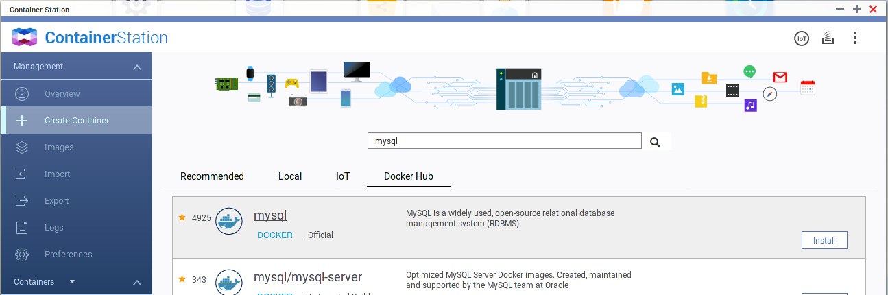
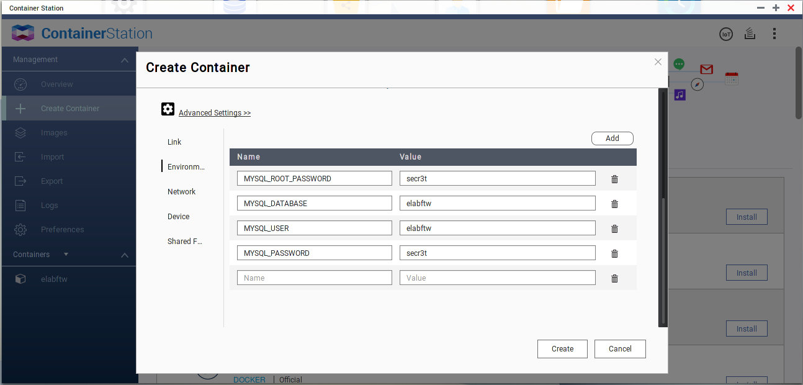
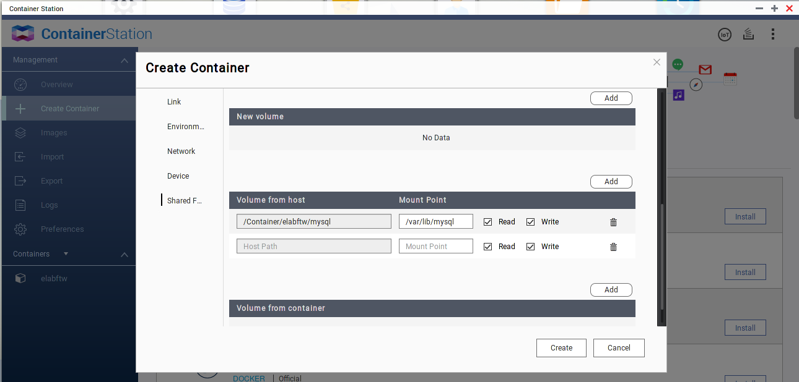
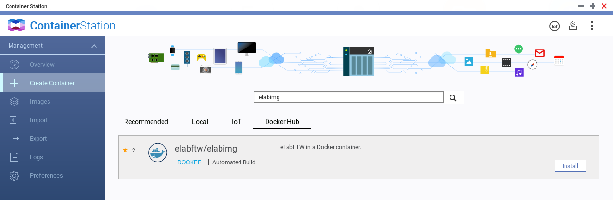
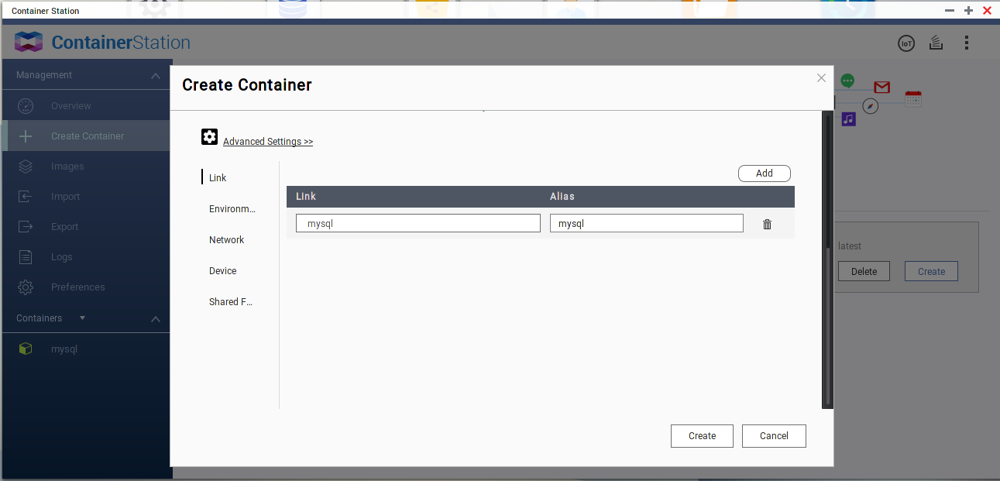
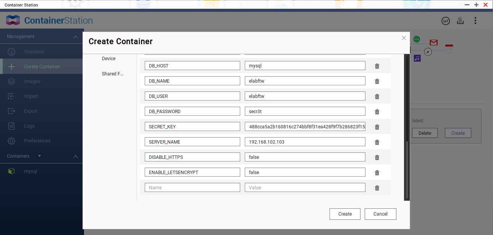
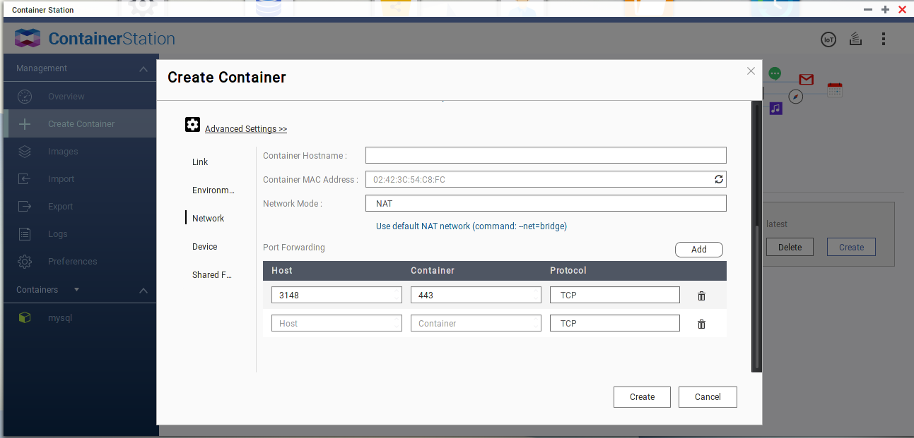
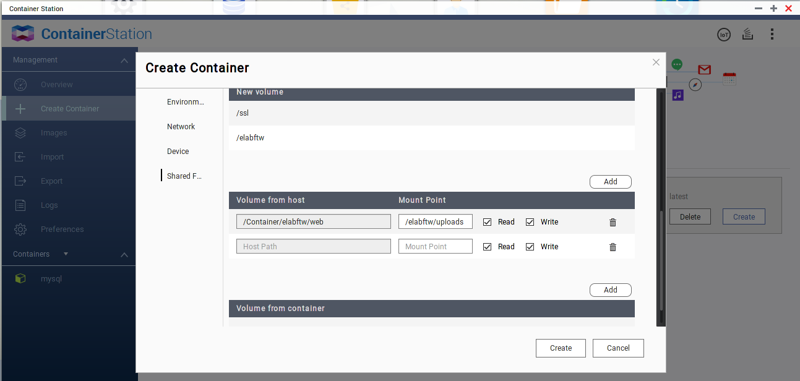

.. _install-nas:

Install on a Qnap NAS
=====================

.. image:: img/qnap.png
    :align: center
    :alt: qnap

Tested with firmware version 4.3.3 on a TVS-EC1080.

.. note:: This has been reported to work on a Synology NAS

This page describes the installation of eLabFTW on a Qnap NAS. The procedure is different than on a normal GNU/Linux server.

.. warning:: Consider this documentation as beta!

Prerequisites
-------------

We will use the Docker container technology, so you need to install the Container Station app from the AppCenter.

.. image:: img/container-app.png
    :align: center
    :alt: container-app

Once it is installed, open it. It will create a /Container folder. Connect with SSH to the NAS and create subfolders for storing eLabFTW files:

.. code-block:: bash

    cd /share/CACHEDEV1_DATA # path might be different on your system
    mkdir -p Container/elabftw/mysql
    mkdir Container/elabftw/web

eLabFTW uses two containers, the official MySQL image and elabftw/elabimg. We will create the MySQL container first because we will need to reference it as a link for the second container.

Install the MySQL container
---------------------------

Come back to the web interface and click "Create container" from the left menu. Search for MySQL in the Docker Hub. Don't use the Recommended one, use the official one from Docker Hub as shown below:

Select the 5.7 version.

Name the container "mysql" and go to the advanced settings. Add 4 environment variables:

MYSQL_USER and MYSQL_DATABASE should be set to "elabftw". MYSQL_PASSWORD and MYSQL_ROOT_PASSWORD should be set to strong passwords.

In the "Shared folders" tab add a Volume from host with "/Container/elabftw/mysql" mounted on "/var/lib/mysql" (read/write) in the container:

Click Create, it takes a few moments for the container to appear in the Overview.

Install the elabftw container
-----------------------------

Click "Create container" and search for "elabimg" in the Docker Hub:

Choose the "latest" version. Name it "elabftw" and go to advanced settings. Add a Link to the mysql container with "mysql" as alias:

Fill the Environment variables like this:

DB_HOST mysql

DB_NAME elabftw

DB_USER elabftw

DB_PASSWORD Here you put the value of MYSQL_PASSWORD from the MySQL container

SECRET_KEY Get yours from https://demo.elabftw.net/install/generateSecretKey.php

SERVER_NAME Use the IP address of your NAS

DISABLE_HTTPS false

ENABLE_LETSENCRYPT false

We will serve eLabFTW on port 3148, add a port forwarding entry with 3148 for Host and 443 for container (protocol TCP):

In the "Shared folders" tab add a Volume from host with "/Container/elabftw/web" mounted on "/elabftw/uploads" (read/write) in the container:

Click Create. Now wait a bit for the container to start (and generate strong DH parameters) and head to https://<YOUR NAS IP>:3148. You should see the register page and you can now register a Sysadmin account.

Post install
------------

Don't forget to read :ref:`the post install page <postinstall>`, setup :ref:`backup <backup>`, and subscribe to `the newsletter <http://elabftw.us12.list-manage1.com/subscribe?u=61950c0fcc7a849dbb4ef1b89&id=04086ba197>`_!

ENJOY! :D
