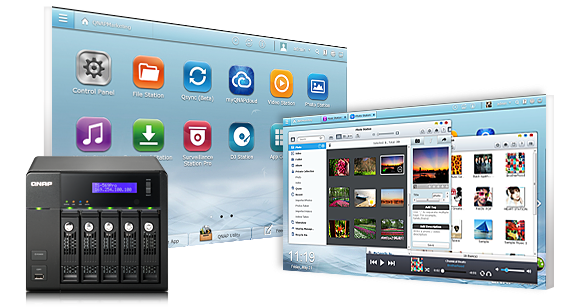
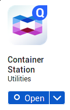
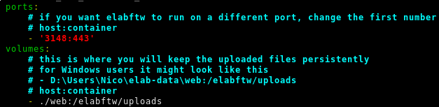
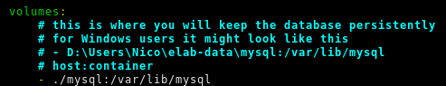

.. _install-nas:

Install on a NAS
================

This page describes the installation of eLabFTW on a Qnap or Synology NAS. The procedure is slightly different than on a normal GNU/Linux server.

The following instructions are for a Qnap NAS but if you have a Synology, it's not much different.

.. note:: Here I'm using the command line but it is also completely possible to do it via the graphical interface

Prerequisites
-------------

We will use the Docker container technology, so you need to install the Container Station app from the AppCenter.

Once it is installed, open it. It will create a /Container folder. Connect with SSH to the NAS and create subfolders for storing eLabFTW files:

.. code-block:: bash

    cd /share/CACHEDEV1_DATA # path might be different on your system
    mkdir -p Container/elabftw/mysql
    mkdir Container/elabftw/web

Get the config file
-------------------

.. code-block:: bash

    cd /share/CACHEDEV1_DATA/Container/elabftw
    curl -so docker-compose.yml "https://get.elabftw.net/?config"

Edit the config file
--------------------

To edit the file we just downloaded, you can use "vim" or just download it on your computer instead, edit it with your favorite text editor and upload it back.

You need to edit the port binding of the elabftw container. So change '443:443' to '3148:443' of the "ports" section of the "web" service.

You also need to edit the "volumes" bindings so that persistent files (MySQL database and uploaded files) are stored there. In the example below, the paths are relative because the "docker-compose.yml" file is in the folder where we expect to store the files, but you can also put an absolute path:

Starting the containers
-----------------------

.. code-block:: bash

    docker-compose up -d

Importing the database structure
--------------------------------

.. code-block:: bash

   docker exec -it elabftw bin/install start

Replace "elabftw" in the command above by the name of the elabftw container if yours is different (for instance if you have several containers running with redis as session handler). You can check this with `elabctl status`.

Accessing elabftw
-----------------

Wait 10 seconds and go to https://YOUR.NAS.IP:3148. You should see the register page.

Post install
------------

Don't forget to setup :ref:`backup <backup>`, and subscribe to `the newsletter <http://elabftw.us12.list-manage1.com/subscribe?u=61950c0fcc7a849dbb4ef1b89&id=04086ba197>`_!

The next step is to read the :ref:`Sysadmin guide <sysadmin-guide>`.

To update, you can do "docker-compose pull" and "docker-compose restart".

It's a good idea to subscribe to `the newsletter <http://elabftw.us12.list-manage1.com/subscribe?u=61950c0fcc7a849dbb4ef1b89&id=04086ba197>`_, to know when new releases are out (you can also see that from the Sysadmin panel).

~Thank you for using `eLabFTW <https://www.elabftw.net>`_ :)
