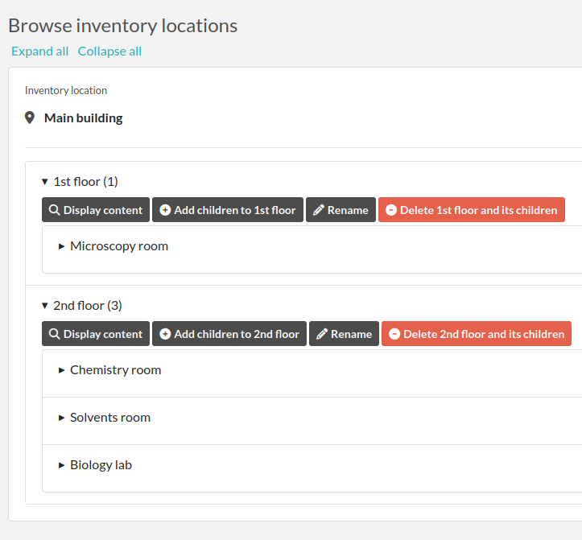
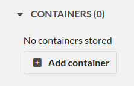
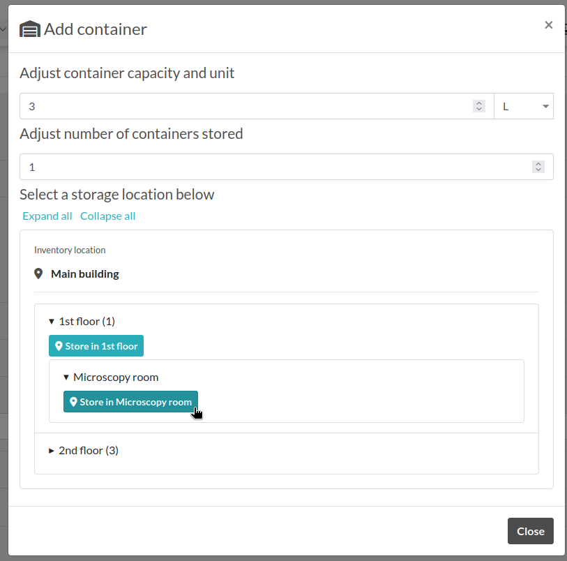

.. _inventory:

*********
Inventory
*********

Introduction
============
eLabFTW allows you to define Inventory Locations from the Inventory page (available from the Tools main menu), and then to create Containers in such locations.

   Inventory page

Getting started
===============

Start by creating Root elements by clicking the "Add root element" button on the right. Root elements should be buildings for instance. They cannot hold Containers directly, only their children can. You can have an arbitrary number of root elements, children and locations.

Add children to the root element(s) created. This is where containers will be defined.

Adding containers
=================

From an Experiment or Resource entry, navigate to the "Containers" section and click "Add container".

   Add container

A modal window opens from where you can adjust the quantity and unit stored, possibly with a multiplier − for instance if you need to store 3 jerrycans of 5L.

   Add container modal window

Navigate to the physical location where container must be stored and click "Store in ..."

Exporting data
==============

From the Inventory page, click the "Export" button in the top right corner to generate a CSV file with a list of stored containers by the current team.

As a Sysadmin, you can do the same from the Sysconfig page with the button "Get inventory report" and get the complete list, regardless of read access.
