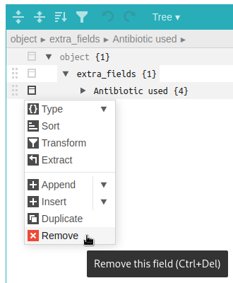

.. _metadata:

********
Metadata
********

This page describes the usage of the metadata JSON field attached to experiments or items (and their templates).

Description
===========

Since eLabFTW 4.0.0, you can add custom JSON data to your entries, using the `metadata` attribute. You can add arbitrary JSON, or use specific keys to extend the customization of the entry, for instance by adding extra fields.

Getting started
===============

Let's try it on an Experiment. Create a new experiment, and scroll down (in edit mode) to the "JSON Editor" part. The "Load metadata" button is disabled because the `metadata` attribute is already loaded in the editor. But for now it is empty.

Click "Add a field", a menu will appear. From there, you must first select which type of input you want for your extra field. Let's select "Dropdown menu" for our example. Enter a name for this input, optionally a description and at least 2 entries to select from.

.. image:: img/extra-field-builder.png
    :align: center
    :alt: Extra field builder

Then click save and the new input (extra field) will appear right under the "Save" and "Save and go back" buttons:

.. image:: img/extra-fields-view.png
    :align: center
    :alt: Extra field view

You are free to add as many as you want, of different types. It is most useful in the Templates, so when creating an entry, all the required inputs are already present.

Advanced use
============

Keep in mind that what the builder menu will do for you is simply create some JSON code and store it in the `metadata` attribute of the entry. You are free to edit this JSON code from the editor.

.. image:: img/json-editor-mode.png
    :align: center
    :alt: json-editor-mode

Positions
---------
In order to assign a particular position to the inputs, use the `position` key, with a number as value. The inputs will then be ordered based on this value. Lowest value being on top.

Removing an input
-----------------
If you wish to remove an input, click the icon on the left of it and select "Remove" from the menu. Alternatively, switch the JSON editor in "Code" view and remove the corresponding part of the JSON.

Masking the main text
---------------------
It is possible to hide the main text input by setting a special attribute: `display_main_text` to `false` in the `elabftw` key. Something like this:

.. code:: javascript

    {
      "extra_fields": {
        ...
        },
      "elabftw": {
        "display_main_text": false
      }
    }

Example code
============

This will allow you to copy/paste easily the following code block into the editor (once the editor's mode is set to "Code"):

.. code:: javascript

    {
      "extra_fields": {
        "End date": {
          "type": "date",
          "value": "2021-06-09",
          "position": 1
        },
        "Magnification": {
          "type": "select",
          "value": "20X",
          "options": [
            "10X",
            "20X",
            "40X"
          ],
          "position": 2
        },
        "Pressure (Pa)": {
          "type": "number",
          "value": "12",
          "position": 3,
          "blank_value_on_duplicate": true
        },
        "Wavelength (nm)": {
          "type": "radio",
          "position": 4,
          "value": "405",
          "options": [
            "488",
            "405",
            "647"
          ]
        }
      }
    }

Now click Save and scroll up a bit. Above the Steps you should now see four new inputs under the "Extra fields" header. When they are modified, the change is saved immediately.

.. image:: img/extra-fields.png
    :align: center
    :alt: extra-fields

How it works
============

Only what is inside an `extra_fields` key is processed, the rest is ignored, so you can have other things in there if you wish.

Inside `extra_fields`, add as many extra field as you want, the key is the name of the field, and the value is composed of:

value (required)
----------------
The field that will hold the selected/input value. You can set a default value here or leave it empty.

type (optional)
---------------
text
^^^^
The default value if omitted. Use it for a short text.

select
^^^^^^
A dropdown element with options to choose from.

radio
^^^^^
A radio input similar to select but all options are immediately visible.

date
^^^^
A date input.

checkbox
^^^^^^^^
A box to check. A Step might be a better option here.

number
^^^^^^
A text input that only accepts a number as value.

url
^^^
A text input that only accepts a valid URL. In view mode, the link will be clickable.

options (for type = select)
---------------------------
An array (`[]`) with different options for the dropdown element.

position
--------
Add a number as a value to correctly order the extra fields how you want them.

blank_value_on_duplicate
------------------------
Set to `true` for the value to be blanked when the entity is duplicated.

Usage example
=============

Have a "Status" and "Quantity" for some items in your database:

.. code:: javascript

    {
      "extra_fields": {
        "Status": {
          "type": "select",
          "value": "In use",
          "options": [
            "Not opened",
            "In use",
            "Need reorder",
            "Out of stock"
          ],
          "position": 2
        },
        "Quantity": {
          "type": "number",
          "value": "12",
          "position": 1
        }
      }
    }

This will produce the following inputs:

.. image:: img/metadata-example.png
    :align: center
    :alt: metadata-example

And if you're looking for all entries that have the status "Need reorder" you can do so from the search page!
