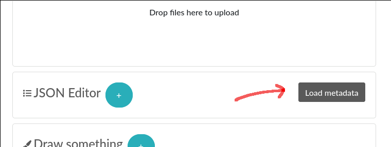

.. _metadata:

Metadata
========

This page describes the usage of the metadata JSON field attached to experiments or items (and their templates).

.. note:: This is still experimental and there is not yet a published schema to validate the JSON. Syntax is subject to change!

Description
-----------

Since eLabFTW 4.0.0, you can add extra fields to your entries. This is done using a JSON metadata attribute.

Getting started
---------------

The first thing you need to do to exploit this feature is to go to your User Control Panel and check the box "Display the JSON editor in edit mode" in the Miscellaneous section, as it is disabled by default.

Once this is enabled, create an experiment and you will see a block "JSON Editor" below the file upload area. Click "Load metadata" on the right.



The editor is now visible and on the top left you can read "Editing metadata", indicating that we are editing the metadata of the current experiment, and not an attached JSON file for instance.

Switch the editor mode from "Tree" to "Code":

.. image:: img/json-editor-mode.png
    :align: center
    :alt: json-editor-mode

This will allow you to copy/paste easily the following code block into the editor:

.. code:: json

    {
      "extra_fields": {
        "End date": {
          "type": "date",
          "value": "2021-06-09"
        },
        "Magnification": {
          "type": "select",
          "value": "20X",
          "options": [
            "10X",
            "20X",
            "40X"
          ]
        },
        "Pressure (Pa)": {
          "type": "number",
          "value": "12"
        },
        "Wavelength (nm)": {
          "type": "radio",
          "value": "405",
          "options": [
            "488",
            "405",
            "647"
          ]
        }
      }
    }

Now click Save and reload the page. Above the Steps you should now see two new inputs under the "Extra fields" header. When they are modified, the change is saved immediately.


.. image:: img/extra-fields.png
    :align: center
    :alt: extra-fields


How it works
------------

Only what is inside an `extra_fields` key is processed, the rest is ignored, so you can have other things in there if you wish.

Inside `extra_fields`, add as many extra field as you want, the key is the name of the field, and the value is composed of:

value (required)
````````````````
The field that will hold the selected/input value. You can set a default value here or leave it empty.

type (optional)
```````````````
text
""""
The default value if omitted. Use it for a short text.

select
""""""
A dropdown element with options to choose from.

radio
"""""
A radio input similar to select but all options are immediately visible.

date
""""
A date input.

checkbox
""""""""
A box to check. A Step might be a better option here.

number
""""""
A text input that only accepts a number as value.

url
"""
A text input that only accepts a valid URL. In view mode, the link will be clickable.

options (for type = select)
```````````````````````````
An array (`[]`) with different options for the dropdown element.

position
````````
Add a number as a value to correctly order the extra fields how you want them.

Usage example
-------------

Have a "Status" and "Quantity" for some items in your database:

.. code:: json

    {
      "extra_fields": {
        "Status": {
          "type": "select",
          "value": "In use",
          "options": [
            "Not opened",
            "In use",
            "Need reorder",
            "Out of stock"
          ],
          "position": 2
        },
        "Quantity": {
          "type": "number",
          "value": "12",
          "position": 1
        }
      }
    }


This will produce the following inputs:

.. image:: img/metadata-example.png
    :align: center
    :alt: metadata-example

And if you're looking for all entries that have the status "Need reorder" you can do so from the search page!

