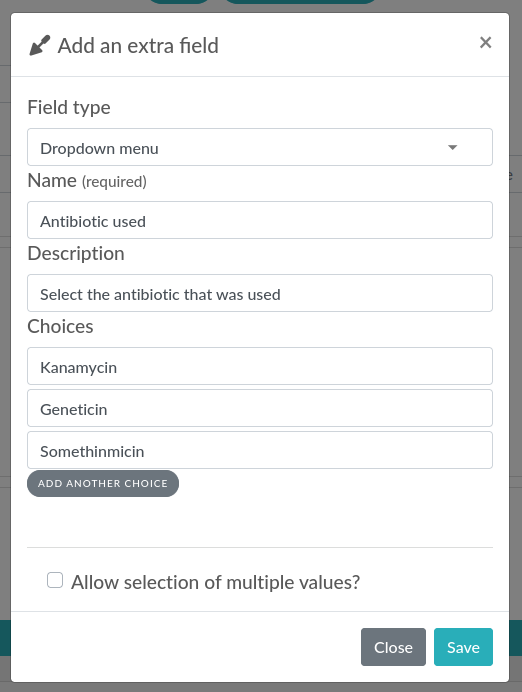

.. _metadata:

********
Metadata
********

This page describes the usage of the metadata JSON field attached to experiments or items (and their templates).

Description
===========

Since eLabFTW 4.0.0, you can add custom JSON data to your entries, using the `metadata` attribute. You can add arbitrary JSON, or use specific keys to extend the customization of the entry, for instance by adding extra fields. Experiments, Items and their templates all have this attribute.

Getting started
===============

Let's try it on an Experiment. Create a new experiment, and scroll down (in edit mode) to the "Extra fields" part.

Click "Add field", a modal window will appear.

If you want your new inputs to appear in groups, you can click the + button next to "Group" to add a new group. Or select an existing group from the dropdown menu.

Then you can select which type of input you want for your extra field. You are free to add as many as you want, of different types. It is most useful to define them in the Templates, so when creating an entry, all the required inputs are already present.

Example with dropdown menu
--------------------------

Let's select "Dropdown menu" for our example. Enter a name for this input, optionally a description and at least 2 entries to select from.

.. image:: img/extra-fields-dropdown.png
    :align: center
    :alt: Extra field dropdown

Then click save and the new input (extra field) will appear right under the "Save" and "Save and go back" buttons:

.. image:: img/extra-fields-view.png
    :align: center
    :alt: Extra field view

Example with number and units
-----------------------------

In our second example, we will add an input of type `number` with several choices for the units. This is how it looks like:

.. image:: img/extra-fields-number.png
    :align: center
    :alt: Extra field number

Then click save and the generated input will accept only numbers, and a dropdown menu with a list of available units will be appended to the input:

.. image:: img/extra-fields-number-view.png
    :align: center
    :alt: Extra field number view

Advanced use
============

Keep in mind that what the builder menu will do for you is simply create some JSON code and store it in the `metadata` attribute of the entry. You are free to edit this JSON code from the editor.

.. image:: img/json-editor-mode.png
    :align: center
    :alt: json-editor-mode

Positions
---------
In order to assign a particular position to the inputs, use the `position` key, with a number as value. The inputs will then be ordered based on this value. Lowest value being on top. Groups are shown in the position they are defined.

Removing an input
-----------------
If you wish to remove an input, click the trash icon present in edit mode on the right side of the input block.

Masking the main text
---------------------
It is possible to hide the main text input by toggling the "Display main text" in the JSON Editor section. 

This will result in the presence of a special attribute: `display_main_text` with a value of `false` in the `elabftw` key:

.. code:: javascript

    {
      "extra_fields": {
        ...
        },
      "elabftw": {
        "display_main_text": false
      }
    }

Example code
============

This will allow you to copy/paste easily the following code block into the editor (once the editor's mode is set to "Code"):

.. code:: javascript

    {
      "extra_fields": {
        "End date": {
          "type": "date",
          "value": "2021-06-09",
          "position": 1
        },
        "Magnification": {
          "type": "select",
          "value": "20X",
          "options": [
            "10X",
            "20X",
            "40X"
          ],
          "position": 2
        },
        "Pressure (Pa)": {
          "type": "number",
          "value": "12",
          "position": 3,
          "blank_value_on_duplicate": true
        },
        "Wavelength (nm)": {
          "type": "radio",
          "position": 4,
          "value": "405",
          "options": [
            "488",
            "405",
            "647"
          ]
        }
      }
    }

Now click Save and scroll up a bit. Above the Steps you should now see four new inputs under the "Extra fields" header. When they are modified, the change is saved immediately.

.. image:: img/extra-fields.png
    :align: center
    :alt: extra-fields

Usage example
=============

Have a "Status" and "Quantity" for some items in your database:

.. code:: javascript

    {
      "extra_fields": {
        "Status": {
          "type": "select",
          "value": "In use",
          "options": [
            "Not opened",
            "In use",
            "Need reorder",
            "Out of stock"
          ],
          "position": 2
        },
        "Quantity": {
          "type": "number",
          "value": "12",
          "position": 1
        }
      }
    }

This will produce the following inputs:

.. image:: img/metadata-example.png
    :align: center
    :alt: metadata-example

And if you're looking for all entries that have the status "Need reorder" you can do so from the search page!

Schema description
==================

In order to be processed by eLabFTW, the JSON contained in `metadata` must be in a particular format. It looks like this:

.. code:: javascript

   {
     "extra_fields": {
       "Some extra field name": {
         "type": "date",
         "value": "2023-06-23",
         ...
       }
     },
     "elabftw" {
       "display_main_text": false,
       "extra_fields_groups": [
         { "id": 1, "name": "Some group" },
         { "id": 2, "name": "Another group" },
       ]
     }
   }

In the `extra_fields` key object, you'll find all the extra fields. The name is the object key, and then it contains properties (described below).

The `elabftw` key is a special key to hold the groups or if we want to display the main text.

The rest will be ignored by eLabFTW, so you can have other things in there, too.

Extra_fields objects
--------------------

Here is a list and description of the properties that `extra_fields` objects can have:

value (required)
^^^^^^^^^^^^^^^^
The field that will hold the selected/input value. You can set a default value here or leave it empty. It is the only required attribute for an `extra_field`.

type (optional)
^^^^^^^^^^^^^^^
checkbox
""""""""
A box to check. A Step might be a better option here.

date
""""
A date input.

datetime-local
""""""""""""""
A date and time input.

email
"""""
An email input: only a valid email address will be accepted.

number
""""""
A text input that only accepts a number as value.

radio
"""""
A radio input similar to select but all options are immediately visible.

select
""""""
A dropdown element with options to choose from.

text
""""
The default value if omitted. Use it for a short text.

time
""""
A time input.

url
"""
A text input that only accepts a valid URL. In view mode, the link will be clickable. By default, the link will open in a new tab. Add `"open_in_current_tab" : true` to make it open in the current tab.

options (for type = select)
^^^^^^^^^^^^^^^^^^^^^^^^^^^
An array of string (`[]`) with different options for the dropdown element.

allow_multi_values (for type = select)
^^^^^^^^^^^^^^^^^^^^^^^^^^^^^^^^^^^^^^
A `boolean` attribute for allowing the selection of multiple values from the dropdown menu (which then becomes a multi select input).

required
^^^^^^^^
A `boolean` attribute to indicate that filling this field is required. Please note that this won't prevent a user from leaving the page even if the value is empty. It will indicate visually that a value is required but won't block the workflow.

description
^^^^^^^^^^^
A `string` attribute that will be displayed under the name of the field.

units (for type = number)
^^^^^^^^^^^^^^^^^^^^^^^^^^^
An array (`[]`) with different units for the units dropdown element. Requires a `unit` attribute to store the selected unit.

unit
^^^^
An attribute used to store the selected unit, will be updated with a change from the `units` generated dropdown menu.

position
^^^^^^^^
Add a number as a value to correctly order the extra fields how you want them.

blank_value_on_duplicate
^^^^^^^^^^^^^^^^^^^^^^^^
Set to `true` for the value to be blanked when the entity is duplicated.

group_id
^^^^^^^^
A number corresponding to the `id` of a group defined in the `elabftw.extra_fields_groups` object. Groups are defined as an array of objects with `id` and `name` properties.

elabftw object
--------------

Another object, with key `elabftw` is used to define some parameters.

display_main_text
^^^^^^^^^^^^^^^^^
A boolean value indicating if we want to display the main text.

extra_fields_groups
^^^^^^^^^^^^^^^^^^^
An array of objects that have an `id` and `name` and corresponds to groups.
