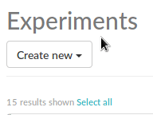
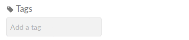
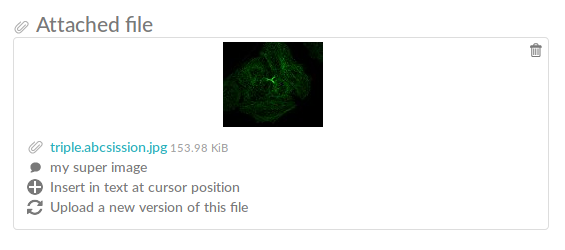

.. _quickstart:

Quickstart
==========

How to use eLabFTW, a quick introduction aimed at users. See the :ref:`manual <manual>` for a more complete description of the software.

Registering an account
----------------------

The first step is to create your account. Head to the registration page, select the correct team and fill the form. Depending on the general settings you might need to wait for manual validation of your account.

Creating your first experiment
------------------------------

Once logged in, you'll be on the "Experiments" tab, which is the main page let's say. From there, you can create an experiment by using the "Create new" menu. This is the "show" mode. You don't have any experiment to show now, but later they will show up on this page. You also have the "view" mode, and the "edit" mode.



Editing the experiment
----------------------

You are now in the "edit" mode of the newly created experiment. From there you can change everything related to the experiment. Let's go through the fields together.

Tags
````

The tags allow you to easily group experiments together. You can think of it as folders, but more powerful because each experiment can have many tags, thus allowing you to cross-search efficiently!

To add a tag, start typing the tag (an autocompletion menu will show up if you already have some tags) and press ENTER to validate the tag. If you don't press ENTER, the tag will not be saved!



To delete a tag, click on it (in edit mode).

Date
````
Self explanatory.

Visibility
``````````
By default, all the experiments you make will be visible to your team. But you can choose to restrict or extend this.

.. note:: In your profile, you can set a default visibility setting for newly created experiments.

Status
``````
By default, a new experiment will have the "Running" status. Once the experiment is done, you can set this status to something else.

.. note:: The admin of the team can fully edit the status list, set the default status or change colors.

Title
`````
Self explanatory.

Experiment
``````````
This is where you write what you did in the lab. You have a text editor with the usual buttons for bold/italic/underline, lists, links, special characters and more.

The default text shown can be configured by the team's admin. You can also have your own templates, check your control panel (|settings|) to manage templates.

.. |settings| image:: img/settings.png

.. note:: From your profile you can disable this rich text editor and write directly in Markdown!

Experiments steps
`````````````````
If your experiment involves several steps, you might want to list them in here. And when you're done with a step, check the corresponding box. The next step will be shown in the "show" mode (when listing experiments). Useful to know what is the next thing you need to do, or to have a good idea of when you did the step (because you get a timestamp when validating a step).

Linked items
````````````
This text input allows you to link to an existing item in the database. The database is the place to store antibodies, plasmids, cell lines, proteins, protocols, whatever you want really. Start typing and you'll see an autocomplete menu, select the wanted item and press ENTER to validate.

You can also use the '#' character in the main text to create a link to an item or an experiment. If you use the '$' in the main text, you'll only search for experiments you own.

.. note:: From a database item, it is easy to find all the experiments that linked to it.

Attach a file
`````````````
Click in the zone or simply drag-and-drop files to upload them. The maximum size of uploads can be configured by the Sysadmin. By default it's 100 Mb.

Once uploaded, the file will appear under the upload zone.



You can add a little comment, insert the image in the text or upload a new version for this file.

Draw something
``````````````
To draw something quick and save it as an image.

Viewing the experiment
----------------------
Once you're done editing the experiment, click the "Save and go back button" to go in the "view" mode. You can share the link to this page with others if you wish. They can leave comments, too.

Using the database
------------------
The second tab is the database. It is common to the team (anyone can edit any item). The team's admin can configure which kind of items (items types) will be shown in the database. An import from an Excel file can also be performed.

Conclusion
----------
That's it for the quickstart (remember it has to be quick!). If you want more infos, check out the full :ref:`manual <manual>`. Otherwise, feel free to click everywhere and see what happens ;)
