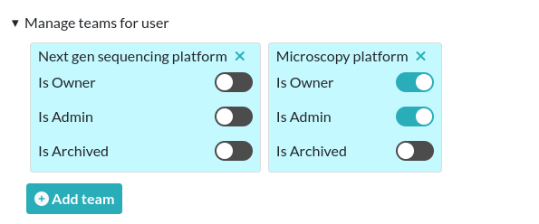

.. _sysadmin-guide:

**************
Sysadmin guide
**************

General overview
================

The Sysadmin
------------
* Is the first registered user
* Has access to the Sysconfig Panel with general settings impacting every team hosted on the server
* Can create/edit/delete teams
* Can send a mass email to all users
* Can set the default language
* Can configure timestamping (if another TSA is wanted)
* Can change security settings (number of login attempts, manual validation of new users)
* It is possible to have multiple 'Sysadmin' accounts

Account creation
----------------
New users need to register an account on the register page, accessible from the login page. They need to choose a team from the list.

By default, newly created accounts are disabled. The admin of the team needs to validate them by going into the admin panel and activate new users.
This guide assumes you already have a working installation of eLabFTW on a server.
The Sysadmin has access to core settings of the eLabFTW instance like email configuration or security preferences.

Setting up email
================

If there is only one thing to do after an install, it's setting up email. Otherwise users will not be able to reset their password!

If a mail server is present, it will work out of the box. However, it is recommended to use an authenticated SMTP account to avoid the emails going to the spam folders of recipients. That is, unless your mail server is perfectly configured (with DKIM and SPF).

Go to the Sysadmin panel (a link is at the bottom left of a page) and add the requested infos.

If you don't know what to do, I highly recommend using `SMTP2GO <https://get.smtp2go.com/xj1zy4rvle6v>`_ (use this referral link), they provide a free plan that will probably be enough for your use case.

.. image:: img/smtp2go.jpg
    :align: center
    :alt: smtp2go logo

Register an account using this link: `SMTP2GO <https://get.smtp2go.com/xj1zy4rvle6v>`_. Once logged in, add an SMTP User: it will provide you with a login and password to connect to the SMTP server "mail.smtp2go.com". Input these credentials on the Sysadmin panel and test sending an email.

Set up backup
=============

See the :ref:`backup <backup>` page.

.. _configure-teams:

Configure teams :sup:`(optional)`
=================================
If your instance hosts different research groups/teams, you can create them from the Sysadmin panel (`sysconfig.php`).

You might also want to edit the Default team name. In the screenshot below, there are four teams. The "Organization ID" is an attribute that you can set in case you wish to use the information sent by an external authentication service (such as SAML or LDAP) to assign a team to a new user. It basically allows you to match a team on eLabFTW with a team in your directory.

The "Visible" attribute allows you to hide a team from the "Register" page. Use it for the administrative team for instance. Only a completely empty team can be deleted.

.. image:: img/sysconfig-teams.png
    :align: center
    :alt: teams

Configure authentication :sup:`(optional)`
==========================================

By default Users are authenticated locally, with their email and a password stored locally in eLabFTW.

You can chose to have other authentication mechanisms such as LDAP or SAMLv2 (IDP). They can be configured in their respective tabs. It is possible to have several mechanisms at the same time but recommended to only leave one visible to users. So if you configure LDAP or SAML, disable the Local login so Users are not confused.

Set up timestamping :sup:`(optional)`
======================================

eLabFTW provides an easy way to do `Trusted Timestamping <https://en.wikipedia.org/wiki/Trusted_timestamping>`_ for your experiments, so you can have strong legal value for your lab notebook.

By default, it is setup to use `pki.dfn.de <https://www.pki.dfn.de/zeitstempeldienst/>`_ as :abbr:`TSA (TimeStampingAuthority)`. It is free for researchers. The only problem, is that they don't have ETSI certification for this service (although their PKI infrastructure is certified ETSI TS 102 042).

So if you need a stronger certification, you should go with a commercial solution providing an :rfc:`3161` way of timestamping documents. We recommend `Universign.com <https://www.universign.com>`_, as they are one of the most serious and recognized :abbr:`TSA (TimeStampingAuthority)` out there, but feel free to use the one you prefer.

You can select from the list of pre-configured TSA or use a custom one by providing the URL and login/password.

Remember: no data is sent to the `TSA (TimeStampingAuthority)`, only the hash of the data is sent, so no information can leak!

Configure automatic timestamping
--------------------------------

You might want to automate the timestamping of experiments, and not rely on users triggering the action manually. For that, you need to setup a recurrent task (cronjob or systemd timer) that will call a console command.

The command is: `bin/console experiments:timestamp --help`. It requires an argument which is the id of the user doing the timestamp. In most cases, using `1` will work fine. Alternatively you can create a specific user for this purpose.

By default, all experiments modified in the past week will be timestamped. So you'll want to adjust your recurrent task periodicity to align with the `--modified-since / -m` setting. Use english terms like "1 month" or "2 weeks" for this option.

Example:

.. code-block:: bash

   # timestamp all the modified experiments from past week
   # run on every Saturday at 3AM
   0 3 * * 6 docker exec elabftw bin/console experiments:timestamp 1

   # timestamp all the modified experiments of past month
   # run the first day of the month at 3AM, in verbose mode
   0 3 1 * *  docker exec elabftw bin/console experiments:timestamp 1 -m "1 month" -v

Configure Keeex
---------------

eLabFTW provides a way to use a `Keeex <https://keeex.me/>`_ service during the timestamp action. It is a technology that allows to guarantee integrity and authenticity of files, autonomously and without third party.

When enabled, the generated pdf for timestamping will be sent over to a Keeex Fusion service running on your network in http mode for keeex/timestamping of the pdf, before being timestamped via your RFC3161 provider.

If you would like to use this service, please `contact us <https://www.deltablot.com/contact>`_.

Configure storage :sup:`(optional)`
===================================

By default, uploaded files are stored in the `uploads/` folder that is mounted outside the container for persistence. You can choose instead to use an S3 compatible service (buckets) to store these files. The "Uploads" tab allows you to configure this storage.

To use S3 storage, set `ELAB_AWS_ACCESS_KEY` and `ELAB_AWS_SECRET_KEY` in your config file. You can use `bin/console uploads:migrate` to migrate existing locally uploaded files to S3 storage.

Set up a cronjob to renew TLS certificates :sup:`(optional)`
=============================================================

It is important to consider already how the TLS certificates will be renewed. Let's Encrypt certificates are valid only 3 months, which is a good thing, because it will allow you to find out much quicker if your setup works.

You will find the documentation for renewal with `certbot` here: `certbot renew certificates <https://eff-certbot.readthedocs.io/en/stable/using.html#renewing-certificates>`_.

If you're encountering issues, do not hesitate to join the eLabFTW chat room to find help: `gitter chat (matrix room) <https://gitter.im/elabftw/elabftw>`_.

Update often
============

It is important to keep your install up to date with the latest bug fixes and new features.

`Subscribe to the newsletter <http://eepurl.com/bTjcMj>`_ to be warned when a new release is out or select "Releases only" from GitHub's Watch button on the `repo page <https://github.com/elabftw/elabftw>`_.

See instructions on updating eLabFTW on :ref:`how-to-update`.

Sysadmin Panel
==============

Server tab
----------

Settings
^^^^^^^^
Note about "Allow the base permission setting «Only me»": if you wish to prevent users from using this Base Permission, select No here.

In order to go over existing entries and change all entries with the Base Permission "Only me" and set it to "Only me + Admins", you can execute these SQL requests:

.. code-block:: sql

    -- experiments read permissions
    update experiments set canread = json_set(canread, '$.base', 20) where
    json_extract(canread, '$.base') = 10;

    -- experiments write permissions
    update experiments set canwrite = json_set(canwrite, '$.base', 20) where
    json_extract(canwrite, '$.base') = 10;

Remote directory configuration
^^^^^^^^^^^^^^^^^^^^^^^^^^^^^^

Ignore this if you are not a CNRS lab.

This allows to query an external endpoint to get a list of users that can be added to the eLabFTW local users database.

Users tab
---------

The Sysadmin can manage Users the same way Admins can manage Users from their Team, but with more options, such as changing the password or attributes, and manage the teams for users.

To make a user part of multiple teams, search for a user, and click the three vertical dot button on the right to open a menu, and select "Manage teams for user". A modal window will allow you to add teams to this user. A user can be admin in a team and not admin in another.

The attribute "is owner" allows you to determine which of the Admins in a Team are the "owner" of the team. It has no impact anywhere and is purely an informational attribute.

Monitoring
==========

Healthchecks
------------

To monitor the nginx service, use ``/healthcheck`` endpoint, which replies with status code 204 if nginx is working.

To monitor the php-fpm service, use ``/php-ping``, which replies with status code 200 if php-fpm is working.

To monitor the nginx, the php-fpm and the MySQL connection, use ``/healthcheck.php``, which replies with status code 200 and ``ok`` in the body of the response if everything is working.

Metrics
-------

To gather metrics from the php-fpm service, use ``/php-status``, which replies with information about php-fpm processes. See the `PHP FPM Status page documentation <https://www.php.net/manual/en/fpm.status.php>`_ for more details.

To gather metrics from the nginx service, use ``/nginx-status``, which replies with information about nginx processes. See the `Nginx status module documentation <https://nginx.org/en/docs/http/ngx_http_stub_status_module.html>`_ for more details.

The ``/php-status`` and ``/nginx-status`` pages are protected with **Basic authentication**:

* user: ``elabftw``
* password: the value of ``STATUS_PASSWORD`` environment variable

If this variable is not set (default), then a random unknown password will be generated but never displayed, effectively disabling access to these pages.

All of the above endpoints will not produce an access log entry.
