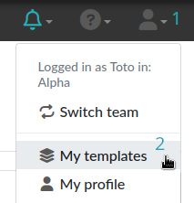
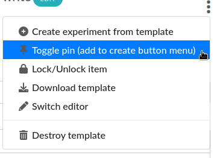
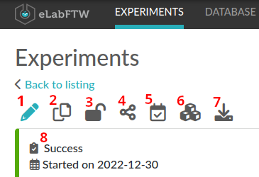
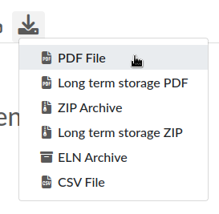

.. _user-guide:

**********
User guide
**********

This guide assumes you already have a working installation of eLabFTW on a server.

General overview
----------------

The principles
~~~~~~~~~~~~~~
By default, experiments and database items are restricted to a team. But users can choose to extend this to all registered users.

Experiments showed on the Experiments tab (the main tab) are yours only. To see experiments from other people in the team use the Search page or enable it from your User Control Panel.

Database items are common to the team and can be edited by anyone from the team.

Creating an account
~~~~~~~~~~~~~~~~~~~
New users need to register an account on the register page (`/register.php`), accessible from the login page. They need to select a team from the list.

By default, newly created accounts are disabled. The admin of the team needs to validate them by going into the admin panel and activate new users.

Experiments
-----------
Once logged in, you can create an experiment by clicking the «Create» button on the top right of the screen. You will be presented with an «edition» page (you can see 'mode=edit' in the URL); the two other modes being 'view': display a single experiment, and 'show': display a list of experiments.

See the getting started video:

.. raw:: html

    <iframe width="560" height="315" src="https://www.youtube.com/embed/k30uyH2_LMM" frameborder="0" allow="accelerometer; autoplay; encrypted-media; gyroscope; picture-in-picture" allowfullscreen></iframe>

Templates
~~~~~~~~~
In order to save time during experiments creation, it is highly recommended to use the Templates for experiments you often do. They are a skeleton of a real experiment. To create a template, select "My templates" from the User menu.



Then, click the "Create" button, enter a title, and start editing your template. Once you are satisfied with it, click save. By default, the template is "pinned", which means it will appear in the menu next to the "Create" button on the main "Experiments" page. If at some point you do not wish to have this template available in this menu, you can toggle its pinned status from the extended menu on the right (three vertical dots) by selecting: "Toggle pin (add to create button menu)":



From this menu you can also choose to download the template as an ELN archive, which can be useful if you want to share it with someone on another eLabFTW instance.

Edit mode
~~~~~~~~~

Tags
````
The tags allow you to easily group experiments together. You can think of it as folders, but more powerful because each experiment can have many tags, thus allowing you to cross-search efficiently!
All experiments with the same tag will be accessible by clicking this tag or searching for it. To validate a tag, press Enter or click outside the input field. It is saved immediately. The number of tags is not limited. Click on a tag to remove it (in edit mode). Tags are common to a team. Autocompletion favors the reuse of existing tags.

.. only:: html

    .. image:: img/quick_tags.*

Date
````
The date is today's date by default, in the format YYYYMMDD. You can edit it as you wish. The real creation date/time is stored in the database in another column.

Status
``````
This useful feature lets you set the 'status' of an experiment. By default you can have :

- Running (selected upon creation)
- Need to be redone
- Success
- Fail

These status can be modified completely by the admin in the admin panel.

Permissions
```````````
The "Visibility" and "Can write" part allow you to control who can access this entry. Click the `Edit` button to display a menu and add or remove permissions.

Title
`````
The title of your experiment. A duplicated experiment will have a «I» character appended to the title upon creation.

Experiment (body)
`````````````````

    .. image:: img/tinymce-editor.png
       :alt: Tinymce editor

This is where you describe your experiment and write your results. It is a rich text editor where you can have formatting, tables, colors, images, links, etc…

Inserting an image
""""""""""""""""""

To insert an image in the main text, simple drag and drop it in the text zone. You can also insert an already uploaded image by selecting "Insert in the text at cursor position" from the uploaded file menu (top right, three vertical dots).

Importing templates
"""""""""""""""""""

You can use the Import > Templates menu to select from existing experiments templates and import them directly in your text, which allows you to compose an experiment by merging several templates.

Using markdown
""""""""""""""

    .. image:: img/markdown-editor.*
       :alt: Markdown editor

You can also use markdown by switching editor (from the menu in the top right, three vertical dots), or selecting markdown as default for your experiments from your user control panel.

Miscellaneous
"""""""""""""

You can insert a timestamp by clicking the clock icon or "Ctrl-Shift-d". You can also insert code snippets with highlighting, special characters, horizontal lines, etc...

Steps
`````
Steps are a way to list the things one need to do during the experiment. So you can write several steps, and once they are done, click the checkbox to declare them finished. This is quite useful for long experiments spanning over several days, where the "Next step" will be shown in Show mode (index list), so you can see at one glance what is the next thing to do for this particular experiment.

Note that you can also declare steps in a template.

Linked items
````````````
This field allows you to link an item from the database. Just begin to type the name of what you want to link and you will see an autocompletion list appear. Select the one you want and press Enter. The number of links is not limited.

This feature can also be used to link an experiment to a particular Project. If you have a «Project» Item Type and have a Project item in your database, you will then be able to see all experiments linked to this project by clicking the Link icon.

Linked experiments
``````````````````
Same as above, but for experiments.

Attach a file
`````````````
You can click this region to open a file browser, or drag-and-drop a file inside. The file size limit depends on the server configuration, and there is no limit on file type. If you upload an image, a thumbnail will be created. There is no limit on the number of files you can attach to an experiment.

When you are done, click the «Save and go back» button.

You are now in view mode.

Ellipsis menu (the three dots on the top right)
```````````````````````````````````````````````

The Switch Editor entry will switch from the WYSIWYG editor (TinyMCE) to the markdown editor. And the Delete entry is to remove the experiment.

View mode of experiment
~~~~~~~~~~~~~~~~~~~~~~~
In the view mode, you will find an actions button bar in the upper left part:



1. Edit
```````
Go into edit mode.

2. Duplicate
````````````
Duplicating an experiment allows you to quickly create a new entry with the same Title, tags, body and links, but with today's date and a running status. Uploaded files are not duplicated. A «I» character will be added to the title to denote that it is a replicate.

3. Toggle lock
``````````````
The lock icon allows you to lock the entry to prevent further editing. If you lock it yourself, you can later unlock it, but if it is locked by an admin, a user won't be able to unlock it.

4. Share
````````
For this button to appear, the Sysadmin must have allowed anonymous users (without an account) to connect, and the box "Allow read access for anonymous users" from the Visibility panel must be checked. An `access_key` is generated and bound to the entry. If this access key is present in the URL, then read access is granted to the visitor.

5. Timestamp
````````````
When you click this button, a timestamp archive is created. Timestamping an experiment means that a pdf is generated, and a cryptographic sum of that pdf is then sent over to a trusted third party: the TimeStamping Authority (TSA). This external service will acknowledge the existence of that pdf (through its cryptographic sum) and send back a token, so that we can later prove that this data was present at that time. The pdf and its token are then attached to the experiment in the attached files section. This timestamp archive is immutable and cannot be modified or deleted. This protocol is defined by RFC3161, a standard for Trusted Timestamping.

6. Bloxberg timestamp
`````````````````````
This button, representing blocks, will do the same timestamping as above, except it will use the blockchain technology and the service provided by the BloxBerg consortium. You can learn more about it here: `BloxBerg website <https://bloxberg.org/discover/mission/>`_.

7. Export button
````````````````



The Export menu allows you to save the entry in different formats. The term "Long term storage" refers to the PDF or the PDF contained in the zip archive being of a particular kind: PDF/A, an ISO-standardized version of the PDF format. It is a PDF format designed for long term storage, but transparent PNG will appear with a black background, so they are no longer the default PDF format, but an option. The PDF/A will also include the changelog, unlike the normal PDF export. It is the PDF format used for timestamping.

The ELN format is a new file format based on RO-Crate specification, containing a special file (in JSON-LD) describing the contents of the dataset (one or several experiments). It is a format designed and promoted by The ELN Consortium, an association of several ELN vendors that agreed on an interchange format for export/import of datasets. You can learn more about it here: `TheELNConsortium on GitHub <https://github.com/TheELNConsortium/>`_.


8. Status
`````````
The status is directly editable from the view mode.


elabid
``````
In the bottom right part of the experiment, you can see something like: «Unique elabid: 20150526-e72646c3ecf59b4f72147a52707629150bca0f91». This number is unique to each experiment. You can use it to reference an experiment with an external database.

Comments
````````
People can leave comments on experiments. They cannot edit your experiment, but they can leave a comment. The owner of the experiment will receive an email if someone comment their experiment.

Database
--------
Same as experiments for a lot of things, except there is no status, but a rating system (little stars). You can store any type of items inside, the admin can edit the available types of items.

In view mode, click the link icon to show all experiments linked with this item.

Examples of database items types:

* antibodies
* microscopes
* plasmids
* drugs
* chemicals
* equipment
* projects

Team
----
This page presents the members and some statistics about the team. You'll also find here a molecule drawer. Note: this molecule drawer can be displayed when you create an experiment. Go to your user control panel to adjust this setting.

Scheduler
~~~~~~~~~
Since version 1.3.0, a scheduler is available to book equipment. First you need to set some item types as bookable from the Admin Panel. After you select an item from the Scheduler page, and use the calendar to book it.

See the video about the scheduler below:

.. raw:: html

   <iframe width="560" height="315" src="https://www.youtube.com/embed/lGESXKV2-CM" frameborder="0" allow="accelerometer; autoplay; encrypted-media; gyroscope; picture-in-picture" allowfullscreen></iframe>

User panel
----------

The user panel is where you can adjust preferences for your account. You can access it by clicking the link in the bottom left of every page, or through the user menu in the top right.

Preferences tab
~~~~~~~~~~~~~~~
From here you can select a language, adjust the display settings, change the keyboard shortcuts, modify the PDF settings, select a different text editor and set the default permission settings.

Account tab
~~~~~~~~~~~
This page allows you to modify your email/password, activate multi-factor authentication and change your name or add your `ORCID <https://orcid.org/>`_ if you have one.

What is two factor authentication?
``````````````````````````````````
Multi-factor authentication, MFA (or Two-factor authentication, 2FA) is a mechanism to further protect your account. After logging in with your password, you will need to enter a 6 digits code that changes every 30 seconds. This code will be displayed by a special application on your cellphone. If you have never used such a mechanism, you need to first install a 2FA application on your phone.

* For Android phones, the recommended application is `Aegis <https://getaegis.app/>`_ (Open Source).
* For iPhone, you can use `Authy <https://authy.com/download/>`_ (Proprietary but with good features).

If you already have a 2FA application, eLabFTW can work with it: you don't need to install another application.

Once this application is installed, on the eLabFTW page, select YES to "Use two-factor authentication?" and click Save. You will then be presented with a QR code, scan it with the application on your phone and enter the code. That's it, now your account is secured with multi-factor authentication.

**Note**: it is highly recommended to enable 2FA wherever you can.

Templates tab
~~~~~~~~~~~~~
Manage your templates. Once a template has been created, you can add tags, steps and links to it. It will then be available from the Create menu.

Api keys tab
~~~~~~~~~~~~
Create an API key for your account from this page. API keys are needed if you wish to access resources through the REST API.

How to have folders or projects grouping experiments?
-----------------------------------------------------

First, try to go beyond the nested, tree-like structure of hierarchical folders.

Imagine you have an experiment which is:

- about "Protein MR73"
- using "Western blot"
- an external collaboration
- with "HEK cells"

Now if that experiment was a file, you might want to store it in "Collaborations > Western Blot > MR73" maybe. Or "Project MR73 > Collaborations > HEK"?

But what if you have another one that is also using HEK cells but has nothing in common with the previous one. How would you go about looking for all the experiments with HEK? And all the experiments related to MR73 that involve a Western Blot?

In a traditional folder structure, you would need to search for it in almost each sub-folders.

Enter **tags**.

Tags
~~~~

Tags are a way to label your experiments (and database objects) with defined keywords and you can have as many as you want!

.. image:: img/tags-view.png
    :align: center
    :alt: tags

Now with the experiments correctly tagged, finding them through different search angles becomes easy! You can search for one tag or many tags directly from the main page.

Favorite tags
~~~~~~~~~~~~~

Over time, you will have some tags that become your favorites, as they are always the ones you look for for a set of experiments.

Since version 4.2.0 it is possible to define "Favorite tags" that will appear in the left pane of the page listing entries. It allows quick overview of related entries. You should try this feature, start by clicking the arrow on the left of the screen to toggle the left pane. Click the + button and start typing a tag to add it to the list of Favorite tags.

    .. image:: img/favtags.*
        :align: center
        :alt: favorite tags

Note that if you use a "Favorite tag" filter and then create an experiment, it will be tagged automatically with that tag.

Using Projects
~~~~~~~~~~~~~~

There is also another way to group experiments together, that you can use along with tags. It's using a database item of type : Project.

Go to the Admin Panel and create a type of item: "Project". Go to the Database tab and create a new "Project" describing a group of experiments, a project. Go to the Experiments tab and create an experiment. In the field "Link to database", type the name of the project and click on the autocompletion field appearing, and press enter (or click outside). This experiment is now linked to the project. So you can easily go to the project description from the experiment, but more importantly, you can from the Project entry, click the "Show related" icon (chainlink) and display all experiments linked to this project!

Make sure to create experiments templates that already link to that Project so the link will always be here when the experiment is created by a user.

Importing data
--------------

It is possible to import data from files into eLabFTW. Click the arrow on the left of the **Create** button to show the `Import from file` menu entry. A modal window appears to allow you to choose:

* Where do you import: either the category of database items, or your experiments or if you are Admin, experiments of other users
* The read/write permission levels of the imported entry(ies)
* The actual file to import

Importing from a .eln archive
~~~~~~~~~~~~~~~~~~~~~~~~~~~~~

You can import data from a .eln archive generated by any ELN software conforming to the `specification <https://github.com/TheELNConsortium/TheELNFileFormat/blob/master/SPECIFICATION.md>`_.

Importing from a .zip archive
~~~~~~~~~~~~~~~~~~~~~~~~~~~~~

Only zip files generated by eLabFTW can be imported here.

Importing from a .csv file
~~~~~~~~~~~~~~~~~~~~~~~~~~

If you already have some "items" catalogued in an Excel file or File Maker database, you can import them in eLabFTW with a .csv file.
A .csv file is a very simple file format. You can save a .xlsx or .ods file into this format. If using Microsoft Office, make sure to select "CSV UTF-8" in the dropdown menu. It needs to be "flat", meaning the first row is the column names, and all subsequent rows correspond to one entry.

To achieve a successful import, make sure to follow these instructions:

1. Preparing the file
`````````````````````

It is important to make sure that the file you are going to import is "clean". Open your file (.xls/.xlsx/.ods/.csv) in an editor like LibreOffice Calc or Microsoft Excel.

Make sure that there are now empty rows or extra information outside the main data. And that you don't have columns with the same name, or columns with no useful information.

You should have a number of columns and rows, looking something like that:

.. list-table:: Example antibodies dataset
   :header-rows: 1

   * - Name
     - Host
     - Target
     - Reference
     - Seller
     - Storage
   * - Anti α-actin
     - Mouse
     - Human
     - AB3148
     - Abcam
     - -20°C
   * - Anti γ-tubulin
     - Rabbit
     - Human
     - AB1337
     - Abcam
     - +4°C


Now you need to have a column named **title**. This is the column that will be picked up as the title of the eLabFTW entry once imported. This column doesn't necessarily needs to be the first one, but it needs to be there. Here we're going to change the "Name" column. So now it looks like this:


.. list-table:: Example antibodies dataset modified
   :header-rows: 1

   * - title
     - Host
     - Target
     - Reference
     - Seller
     - Storage
   * - Anti α-actin
     - Mouse
     - Human
     - AB3148
     - Abcam
     - -20°C
   * - Anti γ-tubulin
     - Rabbit
     - Human
     - AB1337
     - Abcam
     - +4°C

If you wish to include tags during the import, specify a column "tags" that will contain the tags separated by a "|" character. You can also have a "metadata" column containing JSON.

Once you are satisfied with the file, export it as a **.csv** (in File > Save as...). Make a copy of only the first 3 rows and export that too as csv, this will be our test file.

2. Importing the file
`````````````````````

Click "Import from file" from the "Create" submenu. If you haven't done it already, create first an Item Type that fits your data (or ask your Admin to do it). Here we will create an "Antibody" category as that's what we are importing, from the "Items Types" tab.

In the import windows, select the correct category (Antibody in this example). Then select the visibility. Now select your **test** CSV file (with a few rows only) and click the "Import" button.

Every row will correspond to an entry in the correct category of database items. All the columns (except title) will be imported in the body of each entry.

If the import looks good, you can now delete these newly imported items and import your complete file.

Using the API to control how things are imported
````````````````````````````````````````````````

If you want to have complete control over the import process, you can use a helper program to do the import.


.. code-block:: python

    #!/usr/bin/env python
    import elabapy
    import csv

    manager = elabapy.Manager(token="YOUR_TOKEN", endpoint="https://elabftw.example.org/api/v1/")

    # Note: use encoding='utf-8-sig' in the open() call if your file has BOM (Byte Order Mark)
    # Also make sure that the CSV file was saved as UTF-8 to avoid issues with special characters
    with open('some.csv', newline='') as csvfile:
        csvreader = csv.DictReader(csvfile, delimiter=',', quotechar='"')
        for row in csvreader:
            res = manager.create_experiment()
            # start by clearing out the content (default template)
            manager.post_experiment(res['id'], {'body': ''})
            # add a title
            manager.post_experiment(res['id'], {'title': row['title']})
            # now create a body with columns in bold
            manager.post_experiment(res['id'], {'bodyappend': '<strong><h2>Content:</h2></strong>' + row['content'] + '<br>'})
            manager.post_experiment(res['id'], {'bodyappend': '<strong><h2>Category:</h2></strong>' + row['category'] + '<br>'})
            manager.post_experiment(res['id'], {'bodyappend': '<strong><h2>Elabid:</h2></strong>' + row['elabid'] + '<br>'})


Here is another example but this time we import the column as metadata key, and row content as metadata value for all columns except the "title":

.. code-block:: python

    #!/usr/bin/env python
    import elabapy
    import csv
    import json

    # function to build the metadata json for a row
    def getMetadataFromRow(row):
        # our metadata object for one row, currently a dictionary with a key "extra_fields" holding an empty dictionary
        metadata = { 'extra_fields': {} }
        # now go over the columns (except the title) and add it to our extra_fields object
        for keyval in row.items():
            if keyval[0] == 'title':
                continue
            metadata['extra_fields'].update({keyval[0]: {'value': keyval[1]}})
        return json.dumps(metadata)

    manager = elabapy.Manager(token="YOUR_TOKEN", endpoint="https://elabftw.example.org/api/v1/")

    # Note: use encoding='utf-8-sig' in the open() call if your file has BOM (Byte Order Mark)
    # Also make sure that the CSV file was saved as UTF-8 to avoid issues with special characters
    with open('some.csv', newline='') as csvfile:
        csvreader = csv.DictReader(csvfile, delimiter=',', quotechar='"')
        for row in csvreader:
            # let's assume 6 corresponds to our Antibody category database id. Visit /api/v2/items_types to GET a list.
            res = manager.create_item(6)
            # start by clearing out the content (default template)
            manager.post_item(res['id'], {'body': ''})
            # add a title
            manager.post_item(res['id'], {'title': row['title']})
            # add the metadata column
            manager.post_item(res['id'], {'metadata': getMetadataFromRow(row)})


Miscellaneous
-------------

You can export experiments in .zip. If the experiment was timestamped you will find in the archive the timestamped pdf and the corresponding .asn1 token.

You can export and import items from the database (it can be several items).

Press 't' to have a TODO list.

.. raw:: html

   <iframe width="560" height="315" src="https://www.youtube.com/embed/maylkcTAarg" frameborder="0" allow="accelerometer; autoplay; encrypted-media; gyroscope; picture-in-picture" allowfullscreen></iframe>

In the editor, press Ctrl+shift+d to get today's date inserted at cursor position.

Signatures
~~~~~~~~~~

On paper notebooks, there was this idea of having another lab member signing every page of a notebook before the page would get plastified to prevent modifications. To my knowledge, this was seldom done properly.

With eLabFTW, you can have this workflow, but it is much easier to achieve:

- User A finishes an experiment
- User B, that has locking power (Admin + Lock user group) can go on that experiment and click the lock icon

This prevents user A from modifying the content (like plastifying), and it keeps a log of who locked it and when (like signing the page).
