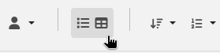
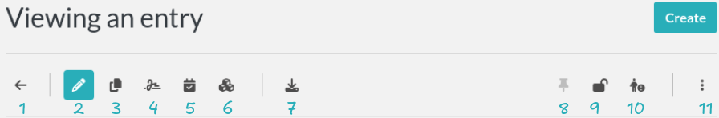

.. _user-guide:

**********
User Guide
**********

This guide is for Users. See also the guides for :doc:`Admins <admin-guide>` and for :doc:`Sysadmins <sysadmin-guide>`.

Introduction
============
There are two main types of entries in eLabFTW: Experiments and Resources. Experiments are owned by a particular User, whereas Resources belong to a team.

While similar, they differ in the following ways:

* Resources but not Experiments can be booked using the Scheduler
* Users can create Experiment templates but not Resource templates
* Only Admins can create Resource templates

Both Resources and Experiments can have Tags and links, along with a Category and a Status. Many of the options for creating and editing Experiment entries are the same as those for Resource entries.

Experiments
===========

Experiment entries are the core of the eLabFTW lab notebook. Select "Experiments" from the menu bar at the top of the page to show a list of Experiment entries.

.. image:: img/user-experiments-menu.png

.. figure:: img/user-show-mode.png
   :alt: eLabFTW Experiments

You can change the page layout by clicking the **Layout** button on the top right of the first listed Experiment:

   Layout button

To make the entries appear like this:

.. figure:: img/user-alt-layout.png
   :alt: eLabFTW alternate layout

   Alternate layout

By default, the page shows both Experiments created by you and those created by other Users in your team. To see **only** your Experiments, you can change the **Scope** using the drop-down menu that appears after clicking the button on the right:

.. image:: img/user-scope-button.png

Set the scope to "*Self*" to display only Experiments that you created. Note that the Resources or Templates pages also allow you to filter entries using the scope button, and your selection is remembered.

You can create an Experiment by clicking the `Create` button on the top right of the screen. You will have the option of selecting an existing Experiment template or using a blank template. You will then be presented with a new Experiment entry. Experiment entries have two different modes: 'edit' and 'view'. By default, when an Experiment is created it will appear in 'edit' mode (you can see 'mode=edit' in the URL).

An Experiment entry can include many different types of information, such as:

* A title
* ID and custom ID numbers
* A Category
* A Status
* Tags
* The main text, which can include images, tables, and links
* Steps
* Extra fields
* Links to other Experiments or Resources
* Attachments

The only required information is the title.

Toolbar
-------
For both Experiment and Resource entries, the top part of the page displays a toolbar with several available actions, as described below.

1. Go back
^^^^^^^^^^
Go back to the index page.

2. Mode
^^^^^^^
Switch between "edit" mode and "view" mode.

3. Duplicate entry
^^^^^^^^^^^^^^^^^^
Create a new entry with the same Title, Tags, text, and links, but with today's date and the Status set as "Running". A pop-up message will ask if you would like to copy the attached files to the duplicated entry. An «I» character is added to the title to indicate that it is a duplicate.

4. Timestamp
^^^^^^^^^^^^
When you click this button, a timestamp archive is created. This is a signed, legally binding snapshot of the entry that is stored alongside the attached files in an immutable archive. Timestamping an entry involves generating a full JSON export of the entry and creating a cryptographic hash of that data. This hash is then sent to a trusted third party: the TimeStamping Authority (TSA).

The TSA acknowledges the existence of the data and sends back a signed token, which serves as proof that the data existed at that specific time. This process follows the :rfc:`3161` standard for Trusted Timestamping.

The timestamped data and corresponding token are then saved in the "Attached Files" section of the entry as a zip file. This file is initially in an "Archived" state, meaning it is hidden from view by default. To view archived files, click the "Show Archived" button on the right side of the "Uploaded Files" section in edit mode:

.. image:: img/show-archived-uploads.png
    :align: center
    :alt: timestamp archive

This timestamp archive is immutable and cannot be modified or deleted.

.. image:: img/timestamp-archive.png
    :align: center
    :alt: timestamp archive

5. Blockchain timestamp
^^^^^^^^^^^^^^^^^^^^^^^
This button will perform the same action as a timestamp, except it will use blockchain technology and the service provided by the Bloxberg consortium. You can learn more about it here: `Bloxberg website <https://bloxberg.org/discover/mission/>`_.

6. Export button
^^^^^^^^^^^^^^^^

The Export menu allows you to save the entry in different file formats.

The ELN format is a new file format based on RO-Crate specification. It contains a special file (in JSON-LD) describing the contents of the dataset (one or several Experiments). It is designed and promoted by The ELN Consortium, an association of several ELN vendors that agreed on an interchange format for export/import of datasets. Learn more about it here: `TheELNConsortium on GitHub <https://github.com/TheELNConsortium/>`_.

7. Pin entry
^^^^^^^^^^^^
Clicking this icon will make this entry appear on top of the list on the main page (pin entry). Use this to easily access frequently used entries.

8. Lock/unlock entry
^^^^^^^^^^^^^^^^^^^^
Use this to lock the entry and prevent further editing. Only an Admin or the user who locked an experiment can unlock it.

9. Ellipsis menu
^^^^^^^^^^^^^^^^

   - Transfer ownership: For entries you created, you can transfer ownership to a different user
   - See revisions: View revisions to the main text of the entry
   - See changelog: View the changelog for the entry
   - Archive/Unarchive: Archiving removes the entry from the default list and adds it to the list of archived entries
   - Delete entry: Perform a :ref:`soft-delete <soft-delete>` of the entry

Date (started on)
-----------------
The date is set to today's date by default. You can edit it as you wish. The effective creation timestamp is stored in the backend database in another (read-only) attribute.

ID
--
This attribute is not editable and corresponds to the unique (to that instance) immutable ID of the entry.

Custom ID
---------
This attribute (``null`` by default) can be set as a number after a Category is selected. Custom ID numbers will then be automatically assigned in an incremental fashion when new Experiments with that Category are created. One can also click the "Get next" button to fetch the next available Custom ID for entries of that Category. The Custom ID is displayed before the title.

Title
-----
This is the title of the Experiment. A duplicated Experiment will have a «I» character appended to the title upon creation.

Category
--------
You can assign a "Category" to each Experiment. Only an Admin can define the categories that are available for your team to use. Categories can correspond to projects, types of Experiments, and other strategies for grouping Experiment entries. You can easily browse groups of Experiments by Category from the main Experiment page.

Status
------
This feature lets you set the 'Status' of an Experiment. The default status options are:

- Running
- Needs to be redone
- Success
- Fail

These Status options can be modified by an admin via the admin panel.

Tags
----
Tags allow users to easily group and sort Experiment entries. You can think of them as folders, but they are more powerful because each Experiment can have many different Tags. The Tag system thus enables efficient cross-searching.
You can list all Experiments with a given Tag by clicking on the Tag or searching for it in the Tag search bar. To add a Tag to an Experiment entry, type the name of the tag in the Tag input field and press Enter or click anywhere outside the input field. You can add an unlimited number of Tags. Click on an existing Tag to launch a prompt that will allow you to remove it (in edit mode). Tags are common to each team. Autocompletion favors the reuse of existing Tags.

.. only:: html

    .. image:: img/quick_tags.*

Permissions
-----------
The "Visibility" and "Can write" menus allow you to control who can access and change a given entry. Click the `Edit` button to view, add, or remove permissions.

Main text
---------
This is the space to freely describe your experimental setting, procedure, results, and any other information you wish to include about your research. In this rich text editor, you can add text with various formatting options, create tables, and add images, links, etc…

    .. image:: img/tinymce-editor.png
       :alt: Tinymce editor

Inserting an image
^^^^^^^^^^^^^^^^^^

To insert an image into the main text, simply drag and drop it into the text editor. You can also insert an uploaded image by clicking on the ellipsis menu on the file icon in the "Attached Files" section (three vertical dots on top right) and selecting "Insert in the text at cursor position".

Inserting templates
^^^^^^^^^^^^^^^^^^^

From the Insert menu in the text editor, you can select "Insert template" to import the contents of the text editor from an existing Experiment template. This allows you to combine content from multiple templates.

Using Markdown
^^^^^^^^^^^^^^

    .. image:: img/markdown-editor.*
       :alt: Markdown editor

You can also use Markdown to create the main text. You can switch to Markdown by clicking the "Switch editor" button at the bottom right of the main text box. If you'd like Markdown to be the default option, go to Settings and select "Disable the rich text editor and write Markdown directly".

Tables
^^^^^^
If you add tables to the text editor you might want to dynamically sort the contained data. Don't worry, eLabFTW has you covered. Sort icons are displayed in "view" mode when "header cells" (``<th>``) are defined and a table is set as sortable. The table should have column names in the top row. You can select the top row by clicking the left mouse button with the cursor over the leftmost cell, and while keeping the mouse button pressed, move the cursor to the rightmost cell. Release the mouse button. The top row should be highlighted now. Next, from the text editor menu select «Table» → «Cell» → «Cell properties». In the dialog change the «Cell type» from «Cell» (``<td>``) to «Header cell» (``<th>``). Finally, you can activate sorting by clicking the «sortable table» icon (|sortable-table-icon|) in the tool bar. The icon will also indicate whether a selected table is sortable. After you have saved the changes (see "Saving your changes), you can go to "view" mode and dynamically sort the table. The changed order is not stored in eLabFTW. Merged cells in the top/header row (colspan) and in columns (rowspan) are not supported.

.. |sortable-table-icon| image:: img/sortable-table-icon.png
   :align: middle
   :height: 24px

.. only:: html

   .. image:: img/sort-table.gif
       :align: center
       :alt: Sort table demo

Using LaTeX
^^^^^^^^^^^

It is possible to express mathematical/chemical notation in eLabFTW, and formulas are rendered in both "view" mode and pdf exports.

To do this, eLabFTW uses Mathjax with the ams extension.

Try this (make sure it is not pasted between `<pre>` Tags!):

.. code:: latex

    $$\sum_{i=0}^n i^2 = \frac{(n^2+n)(2n+1)}{6}$$

Use one `$` for inline mode and `$$` for block mode.

Miscellaneous
^^^^^^^^^^^^^

You can use basic text editor shortcuts and code snippets in the text editor to add highlighting, special characters, horizontal lines, etc...

For a list of text shortcuts see this link: `<https://www.tiny.cloud/docs/tinymce/latest/keyboard-shortcuts/>`_

Examples:

    - ctrl+shift+d : add date/time at cursor
    - ctrl+= : subscript
    - ctrl+shift+= : superscript

Steps
-----
You can use steps to list actions that need to be taken in connection with a given Experiment or Resource. When a task has been completed, you can click on the corresponding checkbox to indicate that that step is done. The "Next step" for each Experiment or Resource will be shown on the main Experiments or Resources page (index list) under the title for that entry. This lets you easily view the next step for each entry. You can also view the next steps for your Experiments and Resources by clicking on the "To-Do List" icon at the top left side of the main page.

You can also include steps when making a template.

Linked Resources/Experiments
----------------------------
You can link a Resource or Experiment entry to another Experiment or Resource entry. Just begin to type the name of the entry you want to link in the text editor, Linked Resources field, or Linked Experiments field, and an autocompletion list will appear. Select the entry you want to link and press enter. If you link an entry from the text editor, it will automatically be added to the Linked Experiments/Resources section. The number of links is unlimited.

This feature can be used to view the Resources or Experiments that are linked to a given entry. For example, you can view all the Experiments that use a particular Resource by looking at the Linked Experiments section in the entry for that Resource.

You can also use this feature to organize entries by project, sort of like a folder. For example, you can create a Resource entry for a given project and link all the Experiments and Resources that are associated with that project.

Next to the possibility to preview the content of a linked entry (1) and to delete a link (4), in edit mode, there are two actions to import content from a linked entry:

Import Links (2)
    Links to entries that are present inside a linked entry are copied into the current entry.
    For example, let's say there is an experiment (Time travel) that requires certain reagents (banana peel and beer) and devices (flux capacitor and Mr. Fusion) which are explained in more detail in the corresponding resource entries. The resources are linked to the experiment. Unfortunately, the experiment does not work the first time, so there is need for a second iteration (Time travel II). Time travel II gets a link to Time travel and now all the required reagents and devices can be imported easily by clicking the "Import Links" button.

Import Body (3)
    The text body of a linked entry is copied into the current entry at the cursor position.

Attach a file
-------------
.. image:: img/user-file-uploader.png
    :align: center
    :alt: file uploader

Click this region to open the file browser, or drag and drop a file to this region to add it to the entry. The file size limit depends on the server configuration, but there is no limit on file type. If you upload an image, a thumbnail will be created. There is no limit on the number of files you can attach to an Experiment.

Various file types are recognized by eLabFTW:

* molecule files such as cif, pdb, sdf, and mol files: The resulting icon will display the molecule in 2D or 3D
* DNA files such as FASTA, gb, ape, dna, and gff: These will be displayed via a fully featured viewer
* image files such as png, jpg, gif, and tiff: These will show as a thumbnail icon
* pdf files: These are shown as thumbnail icons and can optionally be included in pdf exports

Saving your changes
-------------------

To save changes made to the text editor, click the floppy disk icon on the top left of the editor, or the Save button below it. Changes in the text editor are saved automatically 7 seconds after the user stopped typing.

Changes made to any other field are saved automatically, or saved when you click outside of the field. A successful save action is indicated by the "Saved" banner that will show at the top left of the screen.

elabid
------
In the bottom right part of the Experiment, you can see something like: «Unique elabid: 20150526-e72646c3ecf59b4f72147a52707629150bca0f91». This number is unique to each Experiment, and immutable (won't ever change). You can use it to reference an Experiment with an external database.

Comments
--------
People can leave comments on Experiments. Not everyone can edit your Experiment, but they can leave a comment. The owner of the Experiment will receive an email if someone comment their Experiment.

Templates
=========

In order to save time when creating Experiments, eLabFTW features a Templates system for Experiments.

It is recommended to create Templates for Experiments you often do. You can think of a Template as a skeleton of a real Experiment. To create a template, select "Templates" from the User menu.

.. image:: img/user-templates-menu.png

Then, click the "Create" button, enter a title, and start editing your template. Once you are satisfied with it, click save. As you can see, you can have different permissions for the template itself, and for the Experiment that will be created from that template.

By default, the template is "pinned", which means it will appear in the pop up window when you click "Create" and also in the menu next to the "Create" button on the "Experiments" page. If at some point you do not wish to have this template available in this menu, you can toggle its pinned Status by clicking the thumbtack icon:

.. image:: img/user-toggle-pin-templates.*

As with Experiments or Resources, use the Scope button to select what you wish to be listed: only your own Templates (*Self*) or more.

Resources
=========
Resources are similar to Experiments, but serve a different purpose: listing and organizing *things* that are used in Experiments.

Many of the options on the Resource entry are the same as those for an Experiment entry.

Only a team Admin can define the Resources Categories from the Admin Panel. Resources Categories could be:

* Antibodies
* Microscopes
* Plasmids
* Drugs
* Chemicals
* Equipment
* Projects

Resources' default permissions allow anyone from the Team to edit them, but you are free to configure them differently.

Look at the :ref:`importing-data` section to learn how to import your Resources from a spreadsheet file or through the API.

Once you have your Resources present, you can mention them in your Experiments by typing ``#`` and their title, and selecting the proposed autocompletion, or use directly the Link system to link them to an Experiment.

Furthermore, Resources can be made bookable, see section below.

Booking Resources
=================

It is possible to use the scheduler (calendar) present on the Team page's first tab to book Resources.

Making a Resource bookable
--------------------------

In order to book a Resource, it needs to be bookable (they are not by default). To do that, go to the Resource, and click "Modify booking parameters" from the top right menu with three vertical dots:

.. image:: img/modify-booking-menu.png
    :align: center
    :alt: modify booking menu

This will show a modal window with various settings:

.. image:: img/modify-booking-modal.png
    :align: center
    :alt: modify booking modal

.. list-table:: Settings description
   :header-rows: 1

   * - Setting
     - Description
   * - Allow booking this Resource
     - This is a general toggle to allow booking of the Resource
   * - Allow overlapping slots
     - Control whether it is allowed to have more than one booking slot at the same time
   * - Maximum slot time (in minutes)
     - Maximum number of minutes allowed for a single booking slot
   * - Maximum per-User future slot allowed
     - Number of future slots allowed for a particular User/Resource couple
   * - Allow cancelling a booking slot
     - Control whether Users are allowed to cancel a booking
   * - Minimum time before a slot can be cancelled (in minutes)
     - If "now" is closer than this number of minutes to the start of the event, it will not be possible to cancel it

Adjusting permissions
---------------------

When a Resource is bookable, a new permission appears: "Can book":

.. image:: img/can-book-setting.png
    :align: center
    :alt: modify booking permissions

By default, it will match who can read the entry, but it can be adjusted to fine tune who exactly has access to this Resource for booking it.

Using the scheduler
-------------------

Once all is set, Users can click the "Book item" button in the toolbar, or select it from the Scheduler page, and click the calendar to drag a booking slot.

.. image:: img/book-item-button.png
    :align: center
    :alt: book item toolbar button

Clicking an existing slot will display a modal window allowing several options such as binding the slot to an Experiment or another Resource, or cancel booking, with or without sending a notification to Users.

.. image:: img/book-edit-modal.png
    :align: center
    :alt: book item edit modal

Note: "Past and future Users who booked this Resource" means all Users who booked the Resource in the past two months and the ones who booked it in the upcoming month.

Compounds
=========

A chemical compounds database is available to all users in all teams, it is a common database for the instance, storing references of all existing compounds. Note that the visibility cannot be changed. Compounds are always visible to everyone with access to the instance. You can access it from the Tools menu.

    The shared compounds database

Compounds have specific properties such as a CAS number or a SMILES/InChI representation. They can also be associated with safety risks. Once a compound is present in the local eLabFTW database, it can be referenced (linked) from an Experiment or a Resource.

Importing a compound from PubChem
---------------------------------

Compounds can be imported from PubChem. From the Compounds page, click the "Import from PubChem" button, you are presented with a modal window:

    Importing compounds from PubChem

You can specify a PubChem CID (a unique identifier for all compounds present in PubChem), or a CAS number (a unique identifier present for most compounds). Input the number (CID or CAS) and click Search. A preview of the data is displayed below. If that is the correct compound, click Import.

Your newly imported compound is now visible in the table listing them all. Double-click it to further edit its properties.

    Editing attributes of a compound

From this window, you can edit all the properties of the compound. Only the "Name" is a mandatory field, all other fields are optional.

The safety section allows you to define health hazards associated with that compound, and also if it is a controlled substance such as a drug precursor, or nanomaterials.

    Editing safety information for a compound

Now that your compound is correctly created, you can click the "Create resource from compound" button on top of this modal window to create a Resource linked with that compound. That resource can be seen as an instantiation of this abstract compound that is present in this common, shared compound database.

With a Resource, you can set permissions and also add more information, attach files, define inventory, and link to other Resources or Experiments.

A Resource (or an Experiment) can be linked to one or several existing Compound, which allows you to create a Resource representing a mixture of compounds.

Creating a compound manually
----------------------------

Maybe you've just created an never-seen before chemical compound, which means you cannot import it from PubChem. In this case, click the "Add compound" button to manually add a compound. Be aware, as mentioned above, the new compound will be visible by all users of the instance. In case you want to keep it confidential, do not add it.

Fingerprints
------------

When you add a compound where the SMILES representation is defined, and if the instance is configured to use the Fingerprinting service, a fingerprint of the compound will be stored in the database, allowing the search for substructures.

Chemical structure editor
-------------------------

Since version 5.2, a chemical structure editor is present in the Tools menu. It allows one to draw molecules and perform operation on them such as searching the compounds database for similar molecules, via a substructure search. This feature requires the compounds present in the common database to be associated with a fingerprint, which is the case if the fingerprinting service is active, and the compounds have a SMILES representation defined.

    Using the editor to draw, import or export molecules

OpenCloning
===========

Since version 5.2, eLabFTW integrates the tool OpenCloning, developed by Manuel Lera Ramirez.

.. note:: To make this tool available in eLabFTW, a specific configuration is required during deployment!

   OpenCloning running inside eLabFTW

A more complete documentation will be present somewhere, sometime. For now, you're on your own! ;)

Settings page
=============

The Settings page is where you can adjust preferences for your account. You can access it by selecting "Settings" from the top right user menu.

General tab
-----------
From here you can select a language, adjust the display settings, change the keyboard shortcuts, modify the PDF settings, select a different text editor and set the default permission settings.

Account tab
-----------
This page allows you to modify your email/password, activate multi-factor authentication and change your name or add your `ORCID <https://orcid.org/>`_ if you have one.

What is two factor authentication?
----------------------------------
Multi-factor authentication, MFA (or Two-factor authentication, 2FA) is a mechanism to further protect your account. After logging in with your password, you will need to enter a 6 digits code that changes every 30 seconds. This code will be displayed by a special application on your cellphone. If you have never used such a mechanism, you need to first install a 2FA application on your phone.

* For Android phones, the recommended application is `Aegis <https://getaegis.app/>`_ (Open Source).
* For iPhone, you can use `Authy <https://authy.com/download/>`_ (Proprietary but with good features).

If you already have a 2FA application, eLabFTW can work with it: you don't need to install another application.

Once this application is installed, on the eLabFTW page, select YES to "Use two-factor authentication?" and click Save. You will then be presented with a QR code, scan it with the application on your phone and enter the code. That's it, now your account is secured with multi-factor authentication.

**Note**: it is highly recommended to enable 2FA wherever you can.

Api keys tab
------------
Create an API key for your account from this page. An API key is like a Username+password for your account. It allows you to interact with eLabFTW programmatically, through the REST API. See :ref:`API documentation <api>`.

How to group Experiments into Projects?
=======================================

There are several options:

1. Use Categories for Experiments: they are defined by an Admin and are common to the Team.
2. Use Tags/favorite Tags: User or Admin defined, depending on the Team settings (by default Users can create new Tags).
3. Use a Resource of Category "Project" and the link system to link Experiments to that Project.
4. Directly link Experiments together using the link system.

First, try to go beyond the nested, tree-like structure of hierarchical folders.

Imagine you have an Experiment which is:

- about "Protein MR73"
- using "Western blot"
- an external collaboration
- with "HEK cells"

Now if that Experiment was a file, you might want to store it in "Collaborations > Western Blot > MR73" maybe. Or "Project MR73 > Collaborations > HEK"?

But what if you have another one that is also using HEK cells but has nothing in common with the previous one. How would you go about looking for all the Experiments with HEK? And all the Experiments related to MR73 that involve a Western Blot?

In a traditional folder structure, you would need to search for it in almost each sub-folders.

Enter **Tags**.

Tags
====

Tags are a way to label your Experiments (and database objects) with defined keywords and you can have as many as you want!

.. image:: img/tags-view.png
    :align: center
    :alt: Tags

Now with the Experiments correctly tagged, finding them through different search angles becomes easy! You can search for one Tag or many Tags directly from the main page.

Favorite Tags
-------------

Over time, you will have some Tags that become your favorites, as they are always the ones you look for for a set of Experiments.

Since version 4.2.0 it is possible to define "Favorite Tags" that will appear in the left pane of the page listing entries. It allows quick overview of related entries. You should try this feature, start by clicking the arrow on the left of the screen to toggle the left pane. Click the + button and start typing a Tag to add it to the list of Favorite Tags.

    .. image:: img/favtags.*
        :align: center
        :alt: favorite Tags

Note that if you use a "Favorite Tag" filter and then create an Experiment, it will be tagged automatically with that Tag.

Using Projects
--------------

There is also another way to group Experiments together, that you can use along with Tags. It's using a Resource of Category: Project.

Go to the Admin Panel and create a Resource Category: "Project". Go to the Resources tab and create a new "Project" entry describing a group of Experiments, a project. Go to the Experiments tab and create an Experiment. In the field "Linked Resources", type the name of the project and click on the autocompletion field appearing, and press enter (or click outside). This Experiment is now linked to the project. So you can easily go to the project description from the Experiment, but more importantly, you can from the Project entry, click the "Show related" icon (chainlink) and display all Experiments linked to this project!

Make sure to create Experiments templates that already link to that Project so the link will always be here when the Experiment is created by a User.

Using Categories
----------------
An Admin can define several Experiments Categories, which are then available to Users in the Team. It is a quick and easy way to group Experiments together.

To-Do List
----------

From the main Experiments or Resources pages, press ``t`` to show your "To-Do List". You can also access the "To-Do List" by clicking on the icon at the top left side of the screen.

Miscellaneous
=============

You can export Experiments in .zip. If the Experiment was timestamped you will find in the archive the timestamped pdf and the corresponding .asn1 token.

You can export and import items from the database (it can be several items).

.. raw:: html

   <iframe width="560" height="315" src="https://www.youtube.com/embed/maylkcTAarg" frameborder="0" allow="accelerometer; autoplay; encrypted-media; gyroscope; picture-in-picture" allowfullscreen></iframe>

In the editor, press Ctrl+shift+d to get today's date inserted at cursor position.

Signatures
==========

Signatures are important in many contexts, such as scientific research.

A signature can prove that this particular *data* has been approved by this particular *human*. It is a different concept than timestamping, which proves that this particular *data* existed at this particular *time*.

eLabFTW allows you to have three different types of signatures.

Handwritten signatures
----------------------

In your Settings page, check the setting: "Enable french style signature block in PDF Export", from the "PDF Configuration" section of the "General" tab. Now, when you generate a PDF, there will be a dedicated section at the bottom to allow signatures of the author and an observer.

Simple signatures
-----------------

In an authenticated application such as eLabFTW, where all Users are identified and vetted, a signature can be clicking a checkbox, leaving a comment, or performing an action such as locking an Experiment.

The level of trust you can associate to this action is reinforced by using multi-factor authentication.

Advanced cryptographic signatures
---------------------------------

Since version 5.1, an advanced signature mechanism exists for eLabFTW. It uses the highly secure Ed25519 public-key signature system and is compatible with `minisign <https://jedisct1.github.io/minisign/>`_.

How does it work?
^^^^^^^^^^^^^^^^^

At a high level
"""""""""""""""
Each User gets a key pair composed of a private and public key. The private key is protected by a passphrase. In order to sign a document, the User provides their passphrase, and the document is cryptographically signed. The signature file is stored alongside the public key and the document being signed. This "Signature archive" also contains a small shell script to verify the signature with ``minisign``.

Before the signature, a meaning is selected (Review, Approval, etc...). The signature involves several actions:

- the cryptographic signature file is created: it signs the data
- this file is stored in an archived zip file (as an attachment to the entry)
- an immutable comment is created, to indicate that a signature occurred

If one bit of the document is modified, the signature won't be valid anymore. This verification can be done at any point in time and doesn't require access to any external service.

The important aspect is the level of trust you can have on the association of a key pair and a particular human. If you can verify that a particular human owns a given private key, then the signature verification done with its public part can be trusted fully.

Low level overview
""""""""""""""""""

.. warning:: This section is for cryptonerds!

We use `Ed25519 <https://ed25519.cr.yp.to/>`_ to create a keypair. We also generate 8 bytes of random bits to have the key id, along with a salt that is `SODIUM_CRYPTO_PWHASH_SCRYPTSALSA208SHA256_SALTBYTES` long.

We also make a checksum using Blake2 of the signature algorithm, the key id, and the private key.
The salt is combined to the passphrase into a Key Derivation Function (KDF): this allows us to derive a key from that passphrase, and we will use it to XOR the key id, the private key, and the checksum. The Key Derivation Function (KDF) is using scrypt (`sodium_crypto_pwhash_scryptsalsa208sha256`).

To save this into a human readable format, the private key is serialized into the minisign format::

    untrusted comment: <arbitrary text>
    base64(<signature_algorithm> || <kdf_algorithm> || <cksum_algorithm> ||
           <kdf_salt> || <kdf_opslimit> || <kdf_memlimit> || <keynum_sk>)

And the public key::

    untrusted comment: <arbitrary text>
    base64(<signature_algorithm> || <key_id> || <public_key>)

The private and public keys are stored under this form in the MySQL database, attached to a particular User.

For signature, we extract the private key thanks to the provided passphrase and create a detached signature of the hash of the message (the message being a full json export of en entry here). This is the pre-hashed version of Ed25519: Ed25519ph (see `RFC8032 Section 5.1 <https://datatracker.ietf.org/doc/html/rfc8032#section-5.1>`_).

We add a trusted comment to the signature data. This comment is trusted because we can verify it with its signature. It is a JSON string with metadata about the signature (who, when, why). A signature file can look like this::

    untrusted comment: <arbitrary text>
    base64(<signature_algorithm> || <key_id> || <signature>)
    trusted_comment: <arbitrary text>
    base64(<global_signature>)

A real-world example::

    untrusted comment: elabftw/50100: signature from key f3690b6554b4f817
    RUTzaQtlVLT4F5C81w4VBNIodngF4Kna0RqfOTY3CGIB+6AlzsFeX2BPpm49HyIKVnZHHhUQ8C/osp/uTyhAo0WrCoASqm2d0w0=
    trusted comment: {"firstname":"Toto","lastname":"Le sysadmin","email":"toto@yopmail.com","created_at":"2024-03-18T00:48:39+01:00","site_url":"https:\/\/elab.local:3148","created_by":"eLabFTW 50100","meaning":"Approval"}
    LvN7bwKzaU3GwjJtEou1aZs2F4jeBJl5kQcblNSmW1mbZlBzL7h0RqfvDZeeIvBS3g6cfnybQAP93QzVFrlfBA==

As you can see, we mention the eLabFTW version and the key id, this is simply a hint about which key has been used (we cannot trust this piece of information).

But the third line can be trusted, and it contains the metadata.

Then we bundle:

* the message (`data.json`)
* the signature file (`data.json.sig`)
* the public key (`key.pub`)
* a shell script to verify the signature (`verify.sh`)

The shell script uses ``minisign`` to verify the data and the signature, allowing anyone to independently verify a signature made by eLabFTW without a need from external tools other than ``minisign``.

This is stored in an immutable `.zip` file, and an immutable comment is added to the entity to make the action more visible.

``signify`` from OpenBSD was also considered, and it uses roughly the same format, but doesn't support trusted comments which is a very useful feature.

Tracking changes
================

In eLabFTW, changes are tracked with a different granularity depending on the instance configuration and the type of change.

For an Experiment or Resource, there are two concepts: the Changelog, and the Revisions. The Revisions only tracks changes of the Main text (body) of the entry. The Changelog tracks all changes, except the content of the main text, as this is handled separately by the Revisions system.

You can access the Changelog or the Revisions through the ellipsis menu (three dots) in the top right of the page for an entry. The Revisions page allows you to compare two versions or restore a particular version of the entry.

All administrative changes, such as creating a new User, promoting a User to Admin, assigning a User in a team, and changing an instance parameter are logged in the Audit logs database table, and visible to the Sysadmin from the Audit Logs tab in Sysconfig panel.

.. _soft-delete:

Soft delete mechanism
=====================

eLabFTW uses a soft-delete mechanism for entries. When you delete an experiment or a resource, it is simply marked as being deleted: its State changes from Normal to Deleted (another possible State would be Archived). This means the entry will still be accessible in the backend database as a deleted entity.

Restoring a deleted entry
-------------------------

Currently, only a Sysadmin with MySQL access is able to restore an entry, by changing the State back to 1.

Example MySQL query to restore an experiment with ID 42:

.. code-block:: sql

   UPDATE experiments SET state = 1 WHERE id = 42;

Values for ``state`` can be found in the `source code <https://github.com/elabftw/elabftw/blob/master/src/Enums/State.php>`_.

Sharing with external collaborators
===================================
If you want to share your results with an external collaborator, you have two options:

Option 1: Export and send
-------------------------
This option is pretty straightforward, you export your entry into a PDF or ZIP archive and send this by email or other means to your collaborator.

If course, this option has its limitations, and is not always the best suited approach, but works 100% of the time.

Option 2: Allow anonymous access
--------------------------------
It is possible to allow Anonymous access to an eLabFTW installation, but this functionality is disabled by default. The Sysadmin must check this parameter from the Sysconfig Panel:

.. image:: img/sysconfig-anonymous.png

Then, Users will have the possibility to generate a link with an access key in its URL, from the Visibility permissions window of an entry, near the bottom:

.. image:: img/user-anonymous-link.png

Sharing this link will give read access to the recipient. If the checkbox is unchecked, previously shared links become obsolete. Using this has the advantage that the recipient can follow the evolution of the results over time.

For this feature to work, the instance must be accessible from an external network.
