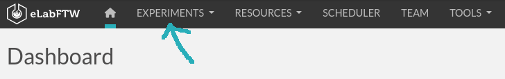
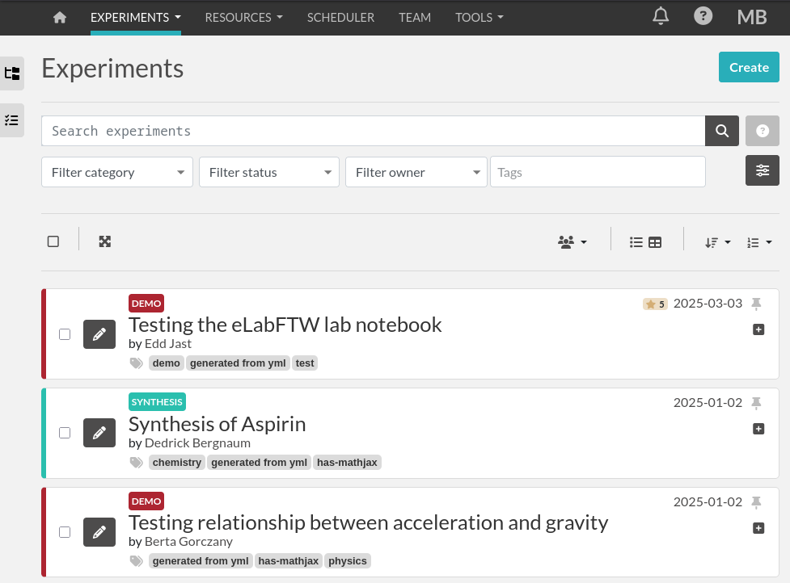
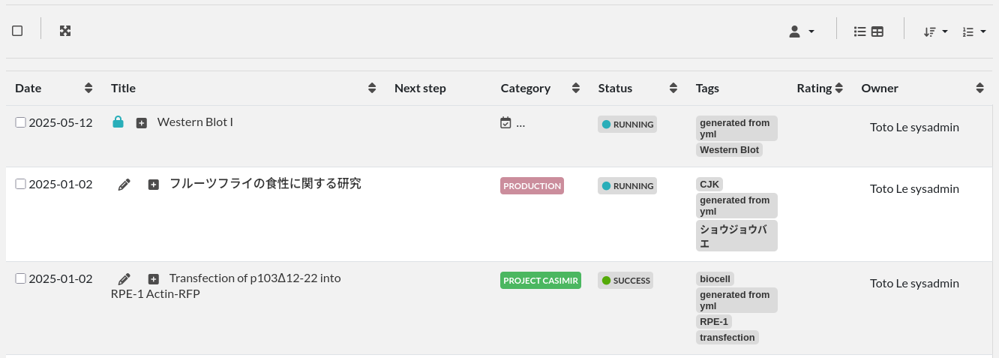
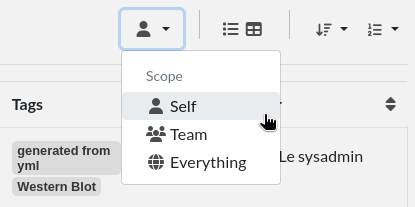
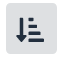

.. _user-guide:

**********
User guide
**********

This guide is aimed to Users, there is also one for :doc:`Admins <admin-guide>` and for :doc:`Sysadmins <sysadmin-guide>`.

Introduction
============
There are two main entities (objects) types: Experiments and Resources. Experiments are owned by a particular user, whereas Resources belong to a team.

While similar, they have a few differences:

* Resources can be booked
* Experiments templates can be created by users
* Resources templates (Resources Categories) can only be created by Admins

They still share a lot of attributes, such as tags, category, status, links, etc...

Experiments
===========

Let's start with the Experiments, because they are the core of a lab notebook. Select Experiments from the main menu. It will display a list of Experiments, this is "Show mode".

Show mode
---------

   List of Experiments in Show mode

If you prefer to list them with a different, more compact display, click the **Switch layout** button on the top right of the first listed Experiment:

.. figure:: img/user-switch-layout.png
   :alt: elabftw switch layout button

   Switch layout button

They will appear like this:

   Alternate listing layout

Experiments are listed by default mixed with experiments from other users in your team. To see **only** your experiments on this page, you need to change the **Scope** from the button on the right:

Set it to "*Self*" to only display your own Experiments. Note that this button is independent from the similar ones on the Resources or Templates pages, and your selection is remembered.

Once logged in, you can create an experiment by clicking the «Create» button on the top right of the screen and selecting a template (or not!). You will then be presented with an «edition» page (you can see 'mode=edit' in the URL); the two other modes being 'view': display a single experiment, and 'show': display a list of experiments.

An experiment is composed of:

* A title
* The main text content

These are the two required elements. In fact, only the title is required as the main content can be empty.

Edit mode
---------

Toolbar
^^^^^^^
In edit mode, the top part of the page displays a toolbar with several actions available:

.. image:: img/user-guide-toolbar-edit.png

1. Go back to the listing
2. Go into "View" mode
3. Duplicate the experiment: will copy all content except attachments, change the Status to the default one, and set the Date to today's date
4. Timestamp experiment: create a signed, legally binding snapshot of the experiment and store it alongside the attached files in an immutable archive
5. Export menu: export the experiment in various formats (PDF, ELN, CSV, etc...)
6. Pin the experiment: make it appear on top of the listing at all times
7. Lock/Unlock experiment: prevent further edition. If you're the one locking it, you'll be able to unlock it, but if it's locked by someone else, you won't
8. Ellipsis menu:
   - Switch editor: you can use the default text editor (WYSIWYG) or the Markdown editor if you prefer markdown
   - See revisions: the revisions system keeps track of changes in the main text of the experiment
   - See changelog: the changelog system keeps track of all the other changes of the experiment
   - Archive/Unarchive: allow hiding the entry from the default listing
   - Delete: perform a soft-deletion of the experiment: mark the experiment as deleted but keep it in the backend database

Date (Started on)
^^^^^^^^^^^^^^^^^
The date is today's date by default. You can edit it as you wish. The effective creation timestamp is stored in the backend database in another (read-only) attribute.

ID
^^
This attribute is not editable and corresponds to the unique (scoped to the instance), immutable ID of the entry.

Custom ID
^^^^^^^^^
This attribute (``null`` by default) can be set as a number, after selecting a Category. This number will then be automatically incremented when a new experiment of that category is created. One can also click the "Get next" button to fetch the next ID available for entries of this Category. The Custom ID is then displayed before the title.

Title
^^^^^
The title of your experiment. A duplicated experiment will have a «I» character appended to the title upon creation.

Category
^^^^^^^^
You can assign a "Category" to your experiments. Only an Admin can define the available categories in your team. They can correspond to projects or types of experiments for instance. It also makes it easier to browse a group of experiments by looking for entries within that category.

Status
^^^^^^
This useful feature lets you set the 'status' of an experiment. By default you can have:

- Running (selected upon creation)
- Need to be redone
- Success
- Fail

These status can be modified completely by the admin in the admin panel.

Tags
^^^^
The tags allow you to easily group experiments together. You can think of it as folders, but more powerful because each experiment can have many tags, thus allowing you to cross-search efficiently!
All experiments with the same tag will be accessible by clicking this tag or searching for it. To validate a tag, press Enter or click outside the input field. It is saved immediately. The number of tags is not limited. Click on a tag to remove it (in edit mode). Tags are common to a team. Autocompletion favors the reuse of existing tags.

.. only:: html

    .. image:: img/quick_tags.*

Permissions
^^^^^^^^^^^
The "Visibility" and "Can write" part allow you to control who can access this entry. Click the `Edit` button to display a menu and add or remove permissions.

Experiment (body)
^^^^^^^^^^^^^^^^^
This is where you describe your experiment and write your results. It is a rich text editor where you can have formatting, tables, colors, images, links, etc…

    .. image:: img/tinymce-editor.png
       :alt: Tinymce editor

Inserting an image
""""""""""""""""""

To insert an image in the main text, simple drag and drop it in the text zone. You can also insert an already uploaded image by selecting "Insert in the text at cursor position" from the uploaded file menu (top right, three vertical dots).

Importing templates
"""""""""""""""""""

You can use the Import > Templates menu to select from existing experiments templates and import them directly in your text, which allows you to compose an experiment by merging several templates.

Using markdown
""""""""""""""

    .. image:: img/markdown-editor.*
       :alt: Markdown editor

You can also use markdown by switching editor (from the menu in the top right, three vertical dots), or selecting markdown as default for your experiments from your user control panel.

Tables
""""""
If you add tables you might want to sort the data in the table dynamically. eLabFTW got you covered. Sort icons will be displayed in view mode when so called header cells (``<th>``) are defined and a table is set sortable. The table should have column names in the top row. You can select the top row with the mouse by clicking the left mouse button on the leftmost cell and while keeping the mouse button pressed move the mouse to the rightmost cell. Release the mouse button. The top row should be highlighted now. Next, from the rich text editor menu select «Table» → «Cell» → «Cell properties». In the dialog change «Cell type» from «Cell» (``<td>``) to «Header cell» (``<th>``). Finally, you can activate the sorting by clicking the «sortable table» icon (|sortable-table-icon|) in the tool bar. The icon will also indicate whether a selected table is sortable. After you saved the changes you can go to view mode and dynamically sort the table. The changed order is not stored in eLabFTW. Merged cells in the top/header row (colspan) and in columns (rowspan) are not supported.

.. only:: html

   .. image:: img/sort-table.gif
       :align: center
       :alt: Sort table demo

Using LaTeX
"""""""""""

It is possible to express mathematical/chemical notations in eLabFTW, and they will be rendered properly in view mode but also in the pdf export.

For this eLabFTW uses Mathjax with ams extension.

Try this (make sure it is not pasted between `<pre>` tags!):

.. code:: latex

    $$\sum_{i=0}^n i^2 = \frac{(n^2+n)(2n+1)}{6}$$

Use one `$` for inline mode and `$$` for block mode.

Miscellaneous
"""""""""""""

You can insert a timestamp by clicking the clock icon or "Ctrl-Shift-d". You can also insert code snippets with highlighting, special characters, horizontal lines, etc...

Steps
^^^^^
Steps are a way to list the things one need to do during the experiment. So you can write several steps, and once they are done, click the checkbox to declare them finished. This is quite useful for long experiments spanning over several days, where the "Next step" will be shown in Show mode (index list), so you can see at one glance what is the next thing to do for this particular experiment.

Note that you can also declare steps in a template.

Linked items
^^^^^^^^^^^^
This field allows you to link an item from the database. Just begin to type the name of what you want to link and you will see an autocompletion list appear. Select the one you want and press Enter. The number of links is not limited.

This feature can also be used to link an experiment to a particular Project. If you have a «Project» Item Type and have a Project item in your database, you will then be able to see all experiments linked to this project by clicking the Link icon.

Linked experiments
^^^^^^^^^^^^^^^^^^
Same as above, but for experiments.

Attach a file
^^^^^^^^^^^^^
.. image:: img/user-file-uploader.png
    :align: center
    :alt: file uploader

You can click this region to open a file browser, or drag-and-drop a file inside. The file size limit depends on the server configuration, but there is no limit on file type. If you upload an image, a thumbnail will be created. There is no limit on the number of files you can attach to an experiment.

Some files are recognized by eLabFTW:

* molecules files such as cif, pdb, sdf, mol files, they will display the molecule in 2D or 3D
* DNA files such as fasta, gb, ape, dna, gff, they will display a fully featured viewer
* images such as png, jpg, gif or tiff will get a thumbnail
* pdf files also get a thumbnail and can optionally be included in pdf exports

Ellipsis menu (the three dots on the top right)
^^^^^^^^^^^^^^^^^^^^^^^^^^^^^^^^^^^^^^^^^^^^^^^

The Switch Editor entry will switch from the WYSIWYG editor (TinyMCE) to the markdown editor. And the Delete entry is to remove the experiment.

---------------

When you are done, click the «Save and go back» button.

You are now in view mode.

View mode of experiment
-----------------------
In the view mode, you will find an actions button bar in the upper left part:

.. image:: img/user-view-toolbar.png
    :align: center
    :alt: view mode numbered

1. Go back
^^^^^^^^^^
Go back to the listing.

2. Edit
^^^^^^^
Switch to edit mode.

3. Duplicate
^^^^^^^^^^^^
Duplicating an experiment allows you to quickly create a new entry with the same Title, tags, body and links, but with today's date and a running status. Uploaded files are not duplicated. A «I» character will be added to the title to denote that it is a replicate.

4. Timestamp
^^^^^^^^^^^^
When you click this button, a timestamp archive is created. Timestamping an experiment means that a pdf is generated, and a cryptographic sum of that pdf is then sent over to a trusted third party: the TimeStamping Authority (TSA). This external service will acknowledge the existence of that pdf (through its cryptographic sum) and send back a token, so that we can later prove that this data was present at that time. The pdf and its token are then attached to the experiment in the attached files section. This timestamp archive is immutable and cannot be modified or deleted. This protocol is defined by RFC3161, a standard for Trusted Timestamping.

5. Bloxchain timestamp
^^^^^^^^^^^^^^^^^^^^^^
This button, representing blocks, will do the same timestamping as above, except it will use the blockchain technology and the service provided by the BloxBerg consortium. You can learn more about it here: `BloxBerg website <https://bloxberg.org/discover/mission/>`_.

6. Export button
^^^^^^^^^^^^^^^^

The Export menu allows you to save the entry in different formats. The term "Long term storage" refers to the PDF or the PDF contained in the zip archive being of a particular kind: PDF/A, an ISO-standardized version of the PDF format. It is a PDF format designed for long term storage, but transparent PNG will appear with a black background, so they are no longer the default PDF format, but an option. The PDF/A will also include the changelog, unlike the normal PDF export. It is the PDF format used for timestamping.

The ELN format is a new file format based on RO-Crate specification, containing a special file (in JSON-LD) describing the contents of the dataset (one or several experiments). It is a format designed and promoted by The ELN Consortium, an association of several ELN vendors that agreed on an interchange format for export/import of datasets. You can learn more about it here: `TheELNConsortium on GitHub <https://github.com/TheELNConsortium/>`_.

7. Toggle pin
^^^^^^^^^^^^^
Clicking this icon will make this entry appear on top of the listing (pin entry).

8. Toggle lock
^^^^^^^^^^^^^^
The lock icon allows you to lock the entry to prevent further editing. If you lock it yourself, you can later unlock it, but if it is locked by an admin, a user won't be able to unlock it.

9. Ellipsis menu
^^^^^^^^^^^^^^^^

.. raw:: html

    <em>Three dots speak volumes, 
    Unveiling hidden options, 
    Ellipsis unfolds.</em>   

elabid
------
In the bottom right part of the experiment, you can see something like: «Unique elabid: 20150526-e72646c3ecf59b4f72147a52707629150bca0f91». This number is unique to each experiment, and immutable (won't ever change). You can use it to reference an experiment with an external database.

Comments
--------
People can leave comments on experiments. They cannot edit your experiment, but they can leave a comment. The owner of the experiment will receive an email if someone comment their experiment.

Templates
=========

In order to save time when creating Experiments, eLabFTW features a Templates system for Experiments.

It is recommended to create Templates for experiments you often do. You can think of a Template as a skeleton of a real experiment. To create a template, select "Templates" from the User menu.

.. image:: img/user-templates-menu.png

Then, click the "Create" button, enter a title, and start editing your template. Once you are satisfied with it, click save. As you can see, you can have different permissions for the template itself, and for the Experiment that will be created from that template.

By default, the template is "pinned", which means it will appear in the pop up window when you click "Create" and also in the menu next to the "Create" button on the "Experiments" page. If at some point you do not wish to have this template available in this menu, you can toggle its pinned status by clicking the thumbtack icon:

.. image:: img/user-toggle-pin-templates.*

As with Experiments or Resources, use the Scope button to select what you wish to be listed: only your own Templates (*Self*) or more.

Resources
=========
Resources are similar to Experiments, but serve a different purpose: listing and organizing *things* that are used in Experiments.

Only a team Admin can define the Resources Categories from the Admin Panel. Resources Categories could be:

* Antibodies
* Microscopes
* Plasmids
* Drugs
* Chemicals
* Equipment
* Projects

Resources' default permissions allow anyone from the Team to edit them, but you are free to configure them differently.

Look at the :ref:`importing-data` section to learn how to import your Resources from a spreadsheet file or through the API.

Once you have your Resources present, you can mention them in your Experiments by typing ``#`` and their title, and selecting the proposed autocompletion, or use directly the Link system to link them to an Experiment.

Furthermore, Resources can be made bookable, see section below.

Booking resources
=================

It is possible to use the scheduler (calendar) present on the Team page's first tab to book resources.

Making a resource bookable
--------------------------

In order to book a resource, it needs to be bookable (they are not by default). To do that, go to the resource, and click "Modify booking parameters" from the top right menu with three vertical dots:

.. image:: img/modify-booking-menu.png
    :align: center
    :alt: modify booking menu

This will show a modal window with various settings:

.. image:: img/modify-booking-modal.png
    :align: center
    :alt: modify booking modal

.. list-table:: Settings description
   :header-rows: 1

   * - Setting
     - Description
   * - Allow booking this resource
     - This is a general toggle to allow booking of the resource
   * - Allow overlapping slots
     - Control whether it is allowed to have more than one booking slot at the same time
   * - Maximum slot time (in minutes)
     - Maximum number of minutes allowed for a single booking slot
   * - Maximum per-user future slot allowed
     - Number of future slots allowed for a particular user/resource couple
   * - Allow cancelling a booking slot
     - Control whether users are allowed to cancel a booking
   * - Minimum time before a slot can be cancelled (in minutes)
     - If "now" is closer than this number of minutes to the start of the event, it will not be possible to cancel it

Adjusting permissions
---------------------

When a resource is bookable, a new permission appears: "Can book":

.. image:: img/can-book-setting.png
    :align: center
    :alt: modify booking permissions

By default, it will match who can read the entry, but it can be adjusted to fine tune who exactly has access to this resource for booking it.

Using the scheduler
-------------------

Once all is set, users can click the "Book item" button in the toolbar, or select it from the Scheduler page, and click the calendar to drag a booking slot.

.. image:: img/book-item-button.png
    :align: center
    :alt: book item toolbar button

Clicking an existing slot will display a modal window allowing several options such as binding the slot to an experiment or another resource, or cancel booking, with or without sending a notification to users.

.. image:: img/book-edit-modal.png
    :align: center
    :alt: book item edit modal

Note: "Past and future users who booked this resource" means all users who booked the resource in the past two months and the ones who booked it in the upcoming month.

User panel
==========

The user panel is where you can adjust preferences for your account. You can access it by clicking the link in the bottom left of every page, or through the user menu in the top right.

Preferences tab
---------------
From here you can select a language, adjust the display settings, change the keyboard shortcuts, modify the PDF settings, select a different text editor and set the default permission settings.

Account tab
-----------
This page allows you to modify your email/password, activate multi-factor authentication and change your name or add your `ORCID <https://orcid.org/>`_ if you have one.

What is two factor authentication?
^^^^^^^^^^^^^^^^^^^^^^^^^^^^^^^^^^
Multi-factor authentication, MFA (or Two-factor authentication, 2FA) is a mechanism to further protect your account. After logging in with your password, you will need to enter a 6 digits code that changes every 30 seconds. This code will be displayed by a special application on your cellphone. If you have never used such a mechanism, you need to first install a 2FA application on your phone.

* For Android phones, the recommended application is `Aegis <https://getaegis.app/>`_ (Open Source).
* For iPhone, you can use `Authy <https://authy.com/download/>`_ (Proprietary but with good features).

If you already have a 2FA application, eLabFTW can work with it: you don't need to install another application.

Once this application is installed, on the eLabFTW page, select YES to "Use two-factor authentication?" and click Save. You will then be presented with a QR code, scan it with the application on your phone and enter the code. That's it, now your account is secured with multi-factor authentication.

**Note**: it is highly recommended to enable 2FA wherever you can.

Templates tab
-------------
Manage your templates. Once a template has been created, you can add tags, steps and links to it. It will then be available from the Create menu.

Api keys tab
------------
Create an API key for your account from this page. An API key is like a username+password for your account. It allows you to interact with eLabFTW programmatically, through the REST API. See :ref:`API documentation <api>`.

How to have folders or projects grouping experiments?
=====================================================

There are several options:

1. Use Categories for experiments: they are defined by an Admin and are common to the Team.
2. Use tags/favorite tags: user or Admin defined, depending on the Team settings (by default users can create new tags).
3. Use a Resource of Category "Project" and the link system to link Experiments to that Project.
4. Directly link experiments together using the link system.

First, try to go beyond the nested, tree-like structure of hierarchical folders.

Imagine you have an experiment which is:

- about "Protein MR73"
- using "Western blot"
- an external collaboration
- with "HEK cells"

Now if that experiment was a file, you might want to store it in "Collaborations > Western Blot > MR73" maybe. Or "Project MR73 > Collaborations > HEK"?

But what if you have another one that is also using HEK cells but has nothing in common with the previous one. How would you go about looking for all the experiments with HEK? And all the experiments related to MR73 that involve a Western Blot?

In a traditional folder structure, you would need to search for it in almost each sub-folders.

Enter **tags**.

Tags
====

Tags are a way to label your experiments (and database objects) with defined keywords and you can have as many as you want!

.. image:: img/tags-view.png
    :align: center
    :alt: tags

Now with the experiments correctly tagged, finding them through different search angles becomes easy! You can search for one tag or many tags directly from the main page.

Favorite tags
-------------

Over time, you will have some tags that become your favorites, as they are always the ones you look for for a set of experiments.

Since version 4.2.0 it is possible to define "Favorite tags" that will appear in the left pane of the page listing entries. It allows quick overview of related entries. You should try this feature, start by clicking the arrow on the left of the screen to toggle the left pane. Click the + button and start typing a tag to add it to the list of Favorite tags.

    .. image:: img/favtags.*
        :align: center
        :alt: favorite tags

Note that if you use a "Favorite tag" filter and then create an experiment, it will be tagged automatically with that tag.

Using Projects
--------------

There is also another way to group experiments together, that you can use along with tags. It's using a database item of type : Project.

Go to the Admin Panel and create a type of item: "Project". Go to the Database tab and create a new "Project" describing a group of experiments, a project. Go to the Experiments tab and create an experiment. In the field "Link to database", type the name of the project and click on the autocompletion field appearing, and press enter (or click outside). This experiment is now linked to the project. So you can easily go to the project description from the experiment, but more importantly, you can from the Project entry, click the "Show related" icon (chainlink) and display all experiments linked to this project!

Make sure to create experiments templates that already link to that Project so the link will always be here when the experiment is created by a user.

Using Categories
----------------
An Admin can define several Experiments Categories, which are then available to users in the Team. It is a quick and easy way to group experiments together.

.. _importing-data:

Importing data
==============

It is possible to import data from files into eLabFTW. Click the arrow on the left of the **Create** button to show the `Import from file` menu entry. A modal window appears to allow you to choose:

* Where do you import: either the category of database items, or your experiments or if you are Admin, experiments of other users
* The read/write permission levels of the imported entry(ies)
* The actual file to import

Importing from a .eln archive
-----------------------------

You can import data from a .eln archive generated by any ELN software conforming to the `specification <https://github.com/TheELNConsortium/TheELNFileFormat/blob/master/SPECIFICATION.md>`_.

Importing from a .zip archive
-----------------------------

Only zip files generated by eLabFTW can be imported here.

.. _csvimport:

Importing from a .csv file
--------------------------

If you already have some "items" catalogued in an Excel file or File Maker database, you can import them in eLabFTW with a .csv file.
A .csv file is a very simple file format. You can save a .xlsx or .ods file into this format. If using Microsoft Office, make sure to select "CSV UTF-8" in the dropdown menu. It needs to be "flat", meaning the first row is the column names, and all subsequent rows correspond to one entry.

To achieve a successful import, make sure to follow these instructions:

1. Preparing the file
^^^^^^^^^^^^^^^^^^^^^

It is important to make sure that the file you are going to import is "clean". Open your file (.xls/.xlsx/.ods/.csv) in an editor like LibreOffice Calc or Microsoft Excel.

Make sure that there are now empty rows or extra information outside the main data. And that you don't have columns with the same name, or columns with no useful information.

You should have a number of columns and rows, looking something like that:

.. list-table:: Example antibodies dataset
   :header-rows: 1

   * - Name
     - Host
     - Target
     - Reference
     - Seller
     - Storage
   * - Anti α-actin
     - Mouse
     - Human
     - AB3148
     - Abcam
     - -20°C
   * - Anti γ-tubulin
     - Rabbit
     - Human
     - AB1337
     - Abcam
     - +4°C

Now you need to have a column named **title**. This is the column that will be picked up as the title of the eLabFTW entry once imported. This column doesn't necessarily needs to be the first one, but it needs to be there. Here we're going to change the "Name" column. So now it looks like this:

.. list-table:: Example antibodies dataset modified
   :header-rows: 1

   * - title
     - Host
     - Target
     - Reference
     - Seller
     - Storage
   * - Anti α-actin
     - Mouse
     - Human
     - AB3148
     - Abcam
     - -20°C
   * - Anti γ-tubulin
     - Rabbit
     - Human
     - AB1337
     - Abcam
     - +4°C

If you wish to include tags during the import, specify a column "tags" that will contain the tags separated by a "|" character. You can also have a "metadata" column containing JSON.

Once you are satisfied with the file, export it as a **.csv** (in File > Save as...). Make a copy of only the first 3 rows and export that too as csv, this will be our test file.

2. Importing the file
^^^^^^^^^^^^^^^^^^^^^

Click "Import from file" from the "Create" submenu. If you haven't done it already, create first an Item Type that fits your data (or ask your Admin to do it). Here we will create an "Antibody" category as that's what we are importing, from the "Items Types" tab.

In the import windows, select the correct category (Antibody in this example). Then select the visibility. Now select your **test** CSV file (with a few rows only) and click the "Import" button.

Every row will correspond to an entry in the correct category of database items. All the columns (except title) will be imported in the body of each entry.

If the import looks good, you can now delete these newly imported items and import your complete file.

Using the API to control how things are imported
^^^^^^^^^^^^^^^^^^^^^^^^^^^^^^^^^^^^^^^^^^^^^^^^

If you want to have complete control over the import process, you can use a few lines of python to do the import.

.. warning:: **Important**: the scripts linked below will import automatically all the rows present in your CSV file. Try first with a few rows before importing everything, so you have a chance to correct errors easily!

We will use the `elabapi-python` library to make things easy. See `installation instructions <https://github.com/elabftw/elabapi-python#installation>`_.

You can then have a look at `this example to import CSV using the API and metadata/extra fields <https://github.com/elabftw/elabapi-python/blob/master/examples/09-import-csv.py>`_.

Miscellaneous
=============

You can export experiments in .zip. If the experiment was timestamped you will find in the archive the timestamped pdf and the corresponding .asn1 token.

You can export and import items from the database (it can be several items).

Press 't' to have a TODO list.

.. raw:: html

   <iframe width="560" height="315" src="https://www.youtube.com/embed/maylkcTAarg" frameborder="0" allow="accelerometer; autoplay; encrypted-media; gyroscope; picture-in-picture" allowfullscreen></iframe>

In the editor, press Ctrl+shift+d to get today's date inserted at cursor position.

Signatures
==========

On paper notebooks, there was this idea of having another lab member signing every page of a notebook before the page would get plastified to prevent modifications. To my knowledge, this was seldom done properly.

With eLabFTW, you can have this workflow, but it is much easier to achieve:

- User A finishes an experiment
- User B, that has locking power (Admin + Lock user group) can go on that experiment and click the lock icon

This prevents user A from modifying the content (like plastifying), and it keeps a log of who locked it and when (like signing the page).

Tracking changes
================

In eLabFTW, changes are tracked with a different granularity depending on the instance configuration and the type of change.

For an Experiment or Resource, there are two concepts: the Changelog, and the Revisions. The Revisions only tracks changes of the Main text (body) of the entry. The Changelog tracks all changes, except the content of the main text, as this is handled separately by the Revisions system.

You can access the Changelog or the Revisions through the ellipsis menu (three dots) in the top right of the view or edit page of an entry. The Revisions also allows you to compare two versions or restore a particular version.

All administratives changes such as creating a new user, promoting a user to Admin, assigning a user in a team, changing an instance parameter, are logged in the Audit logs database table, and visible to the Sysadmin from the Audit Logs tab in Sysconfig Panel.

When deleting something, the entry/file is not actually deleted but simply marked as being deleted. This prevents destructive actions and allows for easy restoration of accidentally deleted things. This mechanism is called "soft-delete".
